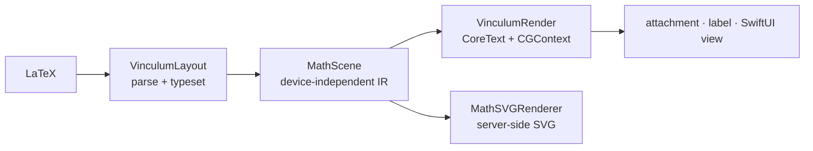

# Vinculum

**Native LaTeX math typesetting for Apple platforms. Real glyph shapes, TeX
metrics from the font's MATH table, a device-independent scene IR — no MathJax,
no KaTeX, no WebView, zero dependencies.**

<!-- badges: replace with real shields once CI/tags are public -->


Vinculum parses LaTeX math into a TeX-style atom tree and typesets it with an
OpenType MATH font — **five bundled** (Latin Modern, TeX Gyre Termes, TeX
Gyre Pagella, STIX Two, and the sans-serif Fira Math) or any OTF you supply — following Knuth's algorithm
(Appendix G of *The TeXbook*) with everything **parsed from the font's MATH
table at runtime**: all 56 layout constants, per-glyph italic corrections
and accent attachment points, cut-in kerning staircases, delimiter size
variants, and glyph assemblies for arbitrarily tall fences and radicals.
Layout is
platform-free and emits a device-independent `MathScene`
of positioned primitives — TeX's DVI in miniature — which a thin CoreGraphics
renderer turns into a baseline-aligned `NSTextAttachment` (or draws into any
`CGContext` you own).

*A vinculum is the bar in a fraction, the line over a root — the stroke that
binds an expression together.* Vinculum is the native math engine extracted
from [Quoin](https://github.com/clintecker/quoin), sibling to
[MermaidKit](https://github.com/clintecker/MermaidKit).

---

## Why native?

Rendering math in a native app has usually meant embedding a JavaScript
math renderer in a `WKWebView`. Vinculum typesets natively instead:

- **No WebView.** No JavaScript runtime, no HTML/CSS reflow, no bridging
  layer, no web-content process to spin up per equation.
- **Real text integration.** Output is an `NSTextAttachment` that flows
  inline in an `NSTextView` / `UITextView` / TextKit layout, sharing the
  text system's baseline, selection, and line-breaking — a WebView
  snapshot never does.
- **The font is the authority.** Everything TeX reads from a font,
  Vinculum reads from the font: the full `MathConstants` sub-table,
  per-glyph italic corrections and accent attachment points, cut-in
  kerning, size-variant ladders, and glyph assemblies.
- **Deterministic, headless-testable geometry** (see the golden-image
  suite and the Linux-tested layout engine), instead of pixels that
  depend on a web engine version.
- **On-device and private.** Nothing leaves the machine.
- Trade-off: Vinculum covers the **everyday LaTeX math** most documents
  actually use, not every macro package a web renderer ships. If you need
  mhchem, siunitx, `\href`, or arbitrary embedded HTML, a WebView still
  wins. Everything unsupported degrades to a named fallback — never a
  broken half-render.

---

## Installation

Swift Package Manager. Add the dependency:

```swift
// Package.swift
dependencies: [
    .package(url: "https://github.com/clintecker/Vinculum.git", from: "1.0.0"),
]
```

Then pick your product(s):

```swift
.target(name: "MyApp", dependencies: [
    .product(name: "VinculumRender", package: "Vinculum"),  // Apple: parse + draw
    // .product(name: "VinculumLayout", package: "Vinculum"), // platform-free layout only
])
```

- **VinculumRender** — the renderer. On Apple platforms it draws with
  CoreText/CoreGraphics (attachments, views, the one-call API); on **Linux**
  it draws with Silica/Cairo/FreeType and produces PNGs
  (`MathSilicaRenderer.renderPNG`, see [docs/LINUX.md](docs/LINUX.md)).
- **VinculumLayout** — platform-free (Foundation only, builds on Linux):
  parsing, macros, and all typesetting geometry, emitting a `MathScene`. Use
  it alone if you supply your own measurer and renderer.

---

## What's new

The 0.24 line is the **font-truth release**: everything the OpenType MATH
table offers, Vinculum now reads and uses — for four bundled fonts or any
math OTF you supply.

- **All metrics from the font, at runtime** — the full 56-value
  `MathConstants` sub-table (axis height, rule thicknesses, script scales,
  every shift and clearance), fontTools-verified and fixture-pinned on
  Linux CI.
- **Per-glyph typography** — italic corrections split superscripts from
  subscripts and tuck `\int`'s lower bound under its slant; accents sit
  on each glyph's `topAccentAttachment`; **cut-in kerning** staircases
  nestle scripts into the base glyph's corners (STIX Two ships kern data
  for 233 glyphs).
- **Glyph assembly** — arbitrarily tall fences and radicals are BUILT from
  the font's end caps and extenders at constant stroke weight; nested
  radicals step through purpose-drawn size variants exactly like TeX.
- **The TeX style lattice** — display/text/script/scriptscript with
  cramping, style-correct constant pairs, spacing suppression in scripts,
  and the `\displaystyle` command family.
- **Four bundled fonts** — Latin Modern, TeX Gyre Termes, TeX Gyre
  Pagella, STIX Two — plus `MathFont(url:)` for your own (see
  [docs/FONTS.md](docs/FONTS.md)).
- **A real product surface** — `VinculumLabel` / SwiftUI `MathView`,
  LaTeX round-tripping (`MathNode.toLaTeX()`), parse diagnostics with
  source ranges, and **spoken math**: VoiceOver reads every equation
  ("x equals the fraction negative b plus or minus…").
- **Hardened** — the whole pipeline is fuzz-tested (grammar, mutation,
  and depth-attack corpora) and never crashes on adversarial input.

See [CHANGELOG.md](CHANGELOG.md) for the full arc.

---

## Quick Start

**Whole documents** — prose with embedded math (markdown notes, chat
messages, LLM output) in one call. All four delimiter styles (`$…$`,
`$$…$$`, `\(…\)`, `\[…\]`), document-scoped `\newcommand` macros, and
unsupported math stays visible as styled source:

```swift
textView.textStorage?.setAttributedString(
    MathText.attributedString(from: modelResponse))
```

The one-liner — a drop-in view (AppKit/UIKit), or SwiftUI:

```swift
let label = VinculumLabel()
label.latex = #"x = \frac{-b \pm \sqrt{b^2 - 4ac}}{2a}"#
// label.font = .stixTwo · .termes · .pagella — or MathFont(url:) for your own

// SwiftUI:
MathView(#"e^{i\pi} + 1 = 0"#).mathFont(.pagella)
```

Or one call turns LaTeX into an inline attachment for a text view:

```swift
import VinculumRender

// Returns nil when the LaTeX contains unsupported commands, so the host keeps
// its own fallback and a document never renders half-broken.
let attributed = MathImageRenderer.attachmentString(
    latex: #"\frac{-b \pm \sqrt{b^2 - 4ac}}{2a}"#,
    display: true,           // display style (stacked limits, larger parts)
    mathTheme: .light,       // .light / .dark / your own
    baseSize: 15)            // point size the surrounding text uses

if let attributed {
    textView.textStorage?.append(attributed)   // flows on the text baseline
}
```

Prefer to drive the pipeline yourself? Layout is platform-free and returns a
device-independent `MathScene`; you decide where to draw it:

```swift
import VinculumLayout   // parse + layout
import VinculumRender   // CoreText measurer + CGContext renderer

let node = MathParser.parse(#"\sum_{i=1}^{n} i^2"#)
guard MathParser.isFullySupported(node) else {
    // name the culprit for a fallback caption:
    // MathParser.unsupportedCommands(in: node)  →  ["\\foo", …]
    return
}

// The delimiter provider is optional; pass it in for MATH-table tall-fence
// variants, or omit it (defaults to nil) to scale base glyphs.
let engine = MathLayoutEngine(
    measure: CoreTextMeasurer.make(),
    baseSize: 15,
    delimiters: CoreTextDelimiterProvider.make())
let scene = engine.layout(node, display: true)   // MathScene: width/ascent/descent + primitives

// Draw into any y-up CGContext (an image, a PDF page, a custom view):
MathSceneRenderer.draw(scene, theme: .dark, in: cgContext, at: penPoint, font: .latinModern)
```

`MathImageRenderer.attachmentString` gives you the cached attachment.
`MathSceneRenderer.draw` is the primitive you build images or PDF pages from —
Vinculum ships no PDF convenience wrapper; you own the context.

---

## Fonts

One engine, four bundled OpenType math fonts — pick per render, or load
any `.otf` that carries a MATH table. Every metric, kern, variant, and
assembly comes from the selected font. **CI regenerates this specimen on
every push** (deep dive: [docs/FONTS.md](docs/FONTS.md)):


| Font | Pair it with | Character |
| --- | --- | --- |
| `.latinModern` *(default)* | Computer Modern / LaTeX-look documents | The classic TeX voice |
| `.termes` | Times, Georgia, serif body text | Narrow, upright, editorial |
| `.pagella` | Palatino, Book Antiqua | Calligraphic warmth |
| `.stixTwo` | Times-family scientific publishing | The STIX standard; richest kerning data |
| `.firaMath` | SF / Helvetica / modern UI text | Sans-serif — visibly distinct from the serif four |

```swift
label.font = .pagella                          // VinculumLabel
MathView(#"e^{i\pi}+1=0"#).mathFont(.stixTwo)  // SwiftUI
MathImageRenderer.attachmentString(latex: src, display: true,
                                   mathTheme: .light, baseSize: 15,
                                   font: .termes)

// Bring your own (must carry an OpenType MATH table):
if let custom = MathFont(url: fontURL) { label.font = custom }
```

---

## Documentation & demo

- **API documentation** ships as a DocC catalog — open the package in
  Xcode and *Product ▸ Build Documentation* for the full curated reference
  (getting started, the document pipeline, fonts, the rendering pipeline).
- **Reference docs** in the repo: [docs/FONTS.md](docs/FONTS.md),
  [docs/ALGORITHM.md](docs/ALGORITHM.md) (the rule-by-rule TeX Appendix G
  audit), [docs/ARCHITECTURE.md](docs/ARCHITECTURE.md),
  [docs/COMMANDS.md](docs/COMMANDS.md) and
  [docs/COVERAGE.md](docs/COVERAGE.md).
- **Try it live**: `swift run VinculumDemo` opens a macOS window — paste
  any text with math in it (an LLM response works beautifully), switch
  fonts, toggle dark rendering.

---

## Gallery

Vinculum renders the everyday math people actually write. **CI regenerates
these posters on every push to `main`** and publishes them to the orphan
[`gallery` branch](https://github.com/clintecker/Vinculum/tree/gallery), so
they always show the *current* rendering — no stale screenshots:


To regenerate them locally, point the gallery test at an output directory:

```bash
VINCULUM_GALLERY_DIR=/tmp/vinculum-gallery \
  swift test --filter GalleryGenerator/testGenerateGallery
# and the multi-page stress corpus:
VINCULUM_STRESS_DIR=/tmp/vinculum-gallery \
  swift test --filter MathStressGallery/testGenerateStressPages
```

The gallery posters cover:

| Poster | Shows |
| --- | --- |
| `01-core.png` | Fractions, roots, sub/superscripts, big operators with stacked limits |
| `02-structures.png` | Auto-sized `\left…\right` fences, matrices, `cases`, `aligned` |
| `03-notation.png` | Accents, `\binom`, `\overbrace`/`\underbrace`, `\xrightarrow`, `\substack`, alphabets, color |
| `04-equations.png` | Real-world equations: quadratic, Euler, Schrödinger, Bayes, Maxwell, the zeta functional product |
| `05-macros.png` | Document-scoped `\newcommand` in action |
| `06-symbols.png` | Standalone delimiters and the extended symbol set |
| `07-fonts.png` | The same equations in all four bundled math fonts |
| `08-font-glyphs.png` | Glyph-by-glyph font comparison (fonts as columns) |
| `09-font-alphabets.png` | Alphabet/script sub-specimen per font |
| `arch-*.png` | Figures for [docs/ARCHITECTURE.md](docs/ARCHITECTURE.md): spacing, delimiters, styles, fallback |
| `cmd-arrows.png` | The extensible `\x…arrow` family, each head drawn distinctly |
| `arch-ssty.png` | `ssty` optical scripts — script glyphs redrawn, not just scaled |

**The complete command charts.** A visual companion to
[docs/COMMANDS.md](docs/COMMANDS.md): *every* command rendered — a font-specimen
grid for each atom class (`sym-relations.png`, `sym-binary.png`,
`sym-operators.png`, `sym-ordinary.png`, `sym-functions.png`, …) plus
source-beside-render structural examples (`cmd-structural.png`), all on the
`gallery` branch and regenerated by CI:


> The repo also carries ~87 golden reference PNGs under
> `Tests/fixtures/math-golden/` (one per construct: `quadratic.png`,
> `integral.png`, `pmatrix.png`, `mathbb.png`, `overbrace.png`, …) that the
> render tests diff against, plus a 66-equation stress corpus
> (`MathStressGallery`) held at 100% native coverage by a CI ratchet. The
> `gallery` branch's raw URLs are stable, so docs and the website can embed
> the always-current posters directly.

Example expressions, all natively rendered:

```latex
x = \frac{-b \pm \sqrt{b^2 - 4ac}}{2a}
e^{i\pi} + 1 = 0
\int_{0}^{\infty} e^{-x^2}\, dx = \frac{\sqrt{\pi}}{2}
\zeta(s) = \sum_{n=1}^{\infty} \frac{1}{n^s} = \prod_{p} \frac{1}{1 - p^{-s}}
\nabla \times \vec{B} = \mu_0 \vec{J} + \mu_0 \epsilon_0 \frac{\partial \vec{E}}{\partial t}
\begin{pmatrix} a & b \\ c & d \end{pmatrix}
```

---

## Support Matrix

Native = renders with real geometry. Everything unsupported degrades to a
named source fallback (`isFullySupported` returns `false`; the render API
returns `nil`) — never a broken half-render. Full, code-checked detail with
examples in [docs/COVERAGE.md](docs/COVERAGE.md); the exhaustive
command-by-command index (every supported `\command`) is in
[docs/COMMANDS.md](docs/COMMANDS.md).

| Feature | Status | Notes |
| --- | :---: | --- |
| Fractions `\frac`, `\cfrac`, `\genfrac` | ✅ | `\cfrac` is a true full-size continued fraction (`[l]`/`[r]` alignment); `\genfrac` is the general 5-arg form (custom fences, rule on/off, forced style) |
| Roots `\sqrt`, `\sqrt[n]{}` | ✅ | Optional degree |
| Sub/superscripts `^` `_` | ✅ | Nested, both, on any atom; cramped-style lowering modeled |
| Big operators with limits | ✅ | `\sum \prod \bigcup \bigcap …` stack limits in display; `\int \oint` keep side-scripts (TeX `\nolimits`) |
| Named operators `\lim \max \min \sup \det \gcd …` | ✅ | 37 function names; the `\lim` family stacks its limit underneath in display |
| `\operatorname`, `\operatorname*` | ✅ | Upright custom operator; `*` stacks limits in display |
| Symbols & Greek (~400 commands) | ✅ | Correct TeX atom classes → real inter-atom spacing |
| Matrix environments | ✅ | `pmatrix bmatrix Bmatrix vmatrix Vmatrix matrix` (+ `*[r]` alignment), `cases`, `smallmatrix`, `substack` |
| Aligned display environments | ✅ | `aligned align alignat split gather gathered multline`; `\tag`/`\tag*`/`\notag` |
| `array` column specs & rules | ✅ | `{l c r \| c}` alignment + `\|` vertical rules + `\hline`/`\cline` — augmented matrices, bordered/truth tables |
| Math alphabets | ✅ | `\mathbb \mathcal \mathscr \mathfrak \mathsf \mathtt \mathbf \boldsymbol \pmb`; `\mathcal`/`\mathfrak`/`\mathscr` cover letters (not digits), `\mathbf` uses a bold system font |
| Accents | ✅ | Point (`\hat \vec \bar \dot \ddot \acute …`), stretchy (`\widehat \widetilde \widecheck`), rules (`\overline \underline`) |
| Over/under constructs | ✅ | `\overbrace`/`\underbrace`, `\overbracket`/`\underbracket`, `\overparen`/`\underparen`, `\overrightarrow` & vector arrows |
| `\binom` / `\dbinom` / `\tbinom` | ✅ | Ruleless paren-fenced; `d`/`t` force display/text size |
| Extended big operators | ✅ | `\iiint \oiint \coprod \bigsqcup \bigvee \bigwedge \bigoplus \bigotimes \bigodot …` |
| `\xrightarrow` / `\xleftarrow` family | ✅ | Stretchy, with over `{}` and under `[]` labels |
| Boxes & rules | ✅ | `\boxed \fbox \colorbox \fcolorbox \rule \raisebox`; `\phantom \hphantom \vphantom \smash \mathrlap \mathllap \mathclap` |
| `\color` / `\textcolor` | ✅ | Braced `{name}{body}` form **and** stateful `\color{name}` for the rest of the group; named + `#rrggbb` |
| Atom-class overrides | ✅ | `\mathbin \mathrel \mathop \mathord \mathopen \mathclose \mathpunct` |
| Strikes & negation | ✅ | `\cancel \bcancel \xcancel \cancelto`; `\not` slashes any relation (`\not\subset` → ⊄) |
| `\text \mathrm \textrm` | ✅ | Upright; interior spaces preserved (`\text{if } x`), inline math via `\text{$…$}` |
| Primes `f'`, `f''` | ✅ | Raised, coalesced primes |
| Direct Unicode math (`∫ ∑ ≤ α`) | ✅ | Classed like its command spelling |
| `\newcommand \renewcommand \def` | ✅ | Document-scoped, `#1…#9`, recursion-capped |
| Spacing `\, \: \; \! \quad \qquad \hspace \kern \mkern` | ✅ | mu-unit spacing from the MATH table |
| `\dfrac` / `\tfrac` / `\dbinom` / `\tbinom` | ✅ | Force display/text style regardless of context |
| `\big \Big \bigg \Bigg` (+`l`/`r`/`m`), `\middle` | ✅ | Enlarge the delimiter 1.2–3×, or a growing `\middle` separator, with correct opening/closing/relation spacing |
| Auto delimiters `\left … \right`, `\middle` | ✅ | Auto-sizes fences to the body; tall `( ) [ ] { }` use MATH-table size variants, others scale |
| `\pmod` / `\bmod` / `\pod` | ✅ | `a \equiv b \pmod{n}`, `a \bmod n` |
| `\sideset`, `\DeclareMathOperator`, `\mathchoice` | ❌ | Degrade to source fallback |
| Harpoon accents, `\utilde` | ❌ | Degrade to source fallback |
| Arbitrarily-tall extensible fences | ⚠️ | Very tall non-`()[]{}` delimiters scale continuously (slightly heavy strokes) rather than assembling from font pieces |
| mhchem `\ce`, siunitx, `\href`, `\includegraphics`, `\verb`, `\begin{CD}` | ❌ | Out of scope by design |

⚠️ = accepted but semantics not fully honored. ❌ = degrades to fallback.

The short tail is honest and documented: extensible delimiter *assembly*
(arbitrarily-tall fences built from font pieces) and the remaining variant
glyphs (`⟨ ⟩ ‖ ⌈ ⌋`), a few macro-table operators (`\DeclareMathOperator`,
`\sideset`, `\mathchoice`), harpoon accents, and packages that are diagrams or
chemistry rather than math (`\begin{CD}`, mhchem, siunitx). Everything there
degrades to a named source fallback, never a broken render.

---

## Architecture

Vinculum mirrors TeX's device-independent split (and MermaidKit's
layout/render seam): **layout decides *what* to draw; a renderer decides
*how*.**



Stage-by-stage sub-diagrams live in
[docs/ARCHITECTURE.md](docs/ARCHITECTURE.md).

- **VinculumLayout** (Foundation only, Linux-buildable) owns parsing, macro
  expansion, and *all* typesetting geometry. `MathLayoutEngine` measures
  glyphs through an injected `MathTextMeasurer` closure (and optional
  `MathDelimiterProvider`) and emits a `MathScene` of positioned primitives
  (`MathElement`: glyph runs, filled rules, stroked paths) in `MathColor`. No
  CoreText, no CoreGraphics — just geometry. The font's MATH-table constants
  live in `MathConstants`; Vinculum's own drawing proportions (radical hook,
  brace arcs, arrowhead) live in `MathLayout`. Every number is named.
- **VinculumRender** (Apple: CoreText/CoreGraphics; Linux: Silica/Cairo/FreeType) is the platform seam:
  `CoreTextMeasurer` implements the measurer via `CTLine`,
  `CoreTextDelimiterProvider` reads MATH-table delimiter size variants,
  `MathSceneRenderer` draws a scene into a `CGContext`, `MathFont` bundles
  Latin Modern Math, `MathTheme` is the host coupling (ink color +
  appearance), and `MathImageRenderer` orchestrates measure → layout → render
  into a cached attachment.

The measurer seam is why layout is headless- and Linux-testable: unit tests
inject a mock measurer and assert on exact geometry, no display required.
Deep dive in [docs/ARCHITECTURE.md](docs/ARCHITECTURE.md).

---

## The one seam: `MathTheme`

Math is monochrome ink on a transparent attachment, so the host coupling is
tiny — a color and the appearance it targets:

```swift
struct MathTheme {
    let ink: PlatformColor      // every stroke/glyph, unless \color overrides a subtree
    let prefersDark: Bool       // pins the appearance while rasterizing + keys the cache
}
```

Use `.light` / `.dark`, or build one from your design system with
`MathTheme(ink:prefersDark:)`. `\color` / `\textcolor` override the ink
per-subtree during layout. That's the whole surface — see
[docs/INTEGRATION.md](docs/INTEGRATION.md).

---

## Platforms

- **macOS 14+, iOS 17+, visionOS 1+, tvOS 17+** — full package (VinculumRender).
- **Linux** — full rendering via Silica/Cairo/FreeType (`MathSilicaRenderer`,
  [docs/LINUX.md](docs/LINUX.md)), server-side SVG (`MathSVGRenderer`), or
  VinculumLayout alone (parsing + geometry; supply your own
  measurer/renderer).
- Swift 6.2+ toolchain, Swift 6 language mode, strict concurrency. Zero third-party dependencies.

> Not Mac Catalyst-tuned: on Catalyst `canImport(AppKit)` is true, so the
> AppKit path compiles but is untested there.

---

## Performance

Measured on Apple silicon (M-series, debug build, medians — the
`MathPerformanceTests` suite re-measures on every run and enforces loose
ceilings):

| Path | Time |
| --- | --- |
| Cold render (parse → layout → rasterize, quadratic formula) | **~0.3 ms** |
| Warm render (cache hit) | **~0.7 µs** |
| Headless layout only (the Linux path) | **~40 µs** |

- **Renders are cached** by content + theme + size + font (`NSCache`,
  bounded by count and pixel-byte cost). A `nil` (unsupported) result is
  cached as a negative entry, so a live editor doesn't re-parse known-bad
  LaTeX every keystroke.
- Layout is allocation-light struct geometry with no WebView spin-up — the
  cost is one CoreText line measurement per glyph run plus arithmetic.
- The parser is bounded twice: a linear pre-scan caps brace/environment
  nesting and a runtime depth counter caps brace-free command recursion —
  adversarial input degrades to fallback instead of overflowing any stack,
  proven by the deterministic fuzz suite (grammar, mutation, and
  depth-attack corpora).

---

## Contributing

Adding a command touches three places — a `MathParser` case, a `Layout+*`
builder, and (for a symbol) a `MathSymbolTable` entry. Layout changes are
verified headless with a mock measurer; render changes diff against the
golden-image suite. See [CONTRIBUTING.md](CONTRIBUTING.md) and the
"add a command" walkthrough in [docs/ARCHITECTURE.md](docs/ARCHITECTURE.md).

---

## License

- **Code:** MIT © 2026 Clint Ecker ([LICENSE](LICENSE)).
- **Bundled fonts:** Latin Modern Math, TeX Gyre Termes Math, and TeX Gyre
  Pagella Math are licensed under the **GUST Font License (GFL)**, an
  OFL-style license; STIX Two Math under the **SIL Open Font License**.
  License texts ship beside the fonts in
  `Sources/VinculumRender/Resources/`. Both licenses permit redistribution
  and embedding.
</content>
</invoke>
