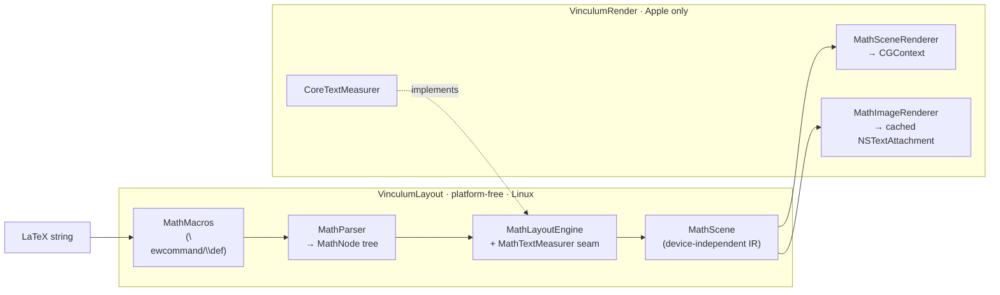

# Vinculum

**Native LaTeX math typesetting for Apple platforms. Real glyph shapes, TeX
metrics from the font's MATH table, a device-independent scene IR — no MathJax,
no KaTeX, no WebView, zero dependencies.**

<!-- badges: replace with real shields once CI/tags are public -->


Vinculum parses LaTeX math into a TeX-style atom tree and typesets it with an
OpenType MATH font (bundled **Latin Modern Math**), reading its layout
constants — axis height, rule thickness, script scales, fraction shifts — from
the font's MATH table the way Knuth's algorithm intends (Appendix G of *The
TeXbook*). Layout is platform-free and emits a device-independent `MathScene`
of positioned primitives — TeX's DVI in miniature — which a thin CoreGraphics
renderer turns into a baseline-aligned `NSTextAttachment` (or draws into any
`CGContext` you own).

*A vinculum is the bar in a fraction, the line over a root — the stroke that
binds an expression together.* Vinculum is the native math engine extracted
from [Quoin](https://github.com/clintecker/quoin), sibling to
[MermaidKit](https://github.com/clintecker/MermaidKit).

---

## Why native?

If you render math in a native app today, you are usually embedding
**KaTeX or MathJax in a `WKWebView`**, or reaching for **[iosMath]**. Vinculum
is a third option with different trade-offs.

**vs. KaTeX / MathJax in a WebView**

- No WebView. No JavaScript runtime, no HTML/CSS reflow, no bridging layer,
  no web-content process to spin up per equation.
- Output is a **`NSTextAttachment`** that flows inline in an `NSTextView` /
  `UITextView` / `TextKit` layout, sharing the text system's baseline,
  selection, and line-breaking — a WebView snapshot never does.
- Deterministic, headless-testable geometry (see the golden-image suite),
  instead of pixels that depend on a web engine version.
- Trade-off: Vinculum covers the **everyday LaTeX math** most documents
  actually use, not every macro package KaTeX ships. If you need mhchem,
  siunitx, `\href`, or arbitrary embedded HTML, a WebView still wins.

**vs. iosMath**

- Swift 6, strict concurrency, `Sendable` layout; macOS + iOS + visionOS +
  tvOS from one package (iosMath is Objective-C, iOS/macOS).
- A **device-independent scene IR** and an injected measurer seam, so the
  entire layout stage builds and unit-tests on **Linux**, headless.
- A `\newcommand`/`\def` macro processor and a document-scoped model.
- Broader current coverage: ~400 symbols, `array` rules, stateful `\color`,
  MATH-table tall-delimiter variants, cramped-style scripts, and more (below).

**vs. rendering to a static image on a server** — Vinculum runs on-device,
offline, private. Nothing leaves the machine.

[iosMath]: https://github.com/kostub/iosMath

---

## Installation

Swift Package Manager. Add the dependency:

```swift
// Package.swift
dependencies: [
    .package(url: "https://github.com/clintecker/Vinculum.git", from: "0.23.0"),
]
```

Then pick your product(s):

```swift
.target(name: "MyApp", dependencies: [
    .product(name: "VinculumRender", package: "Vinculum"),  // Apple: parse + draw
    // .product(name: "VinculumLayout", package: "Vinculum"), // platform-free layout only
])
```

- **VinculumRender** — Apple platforms. Everything below, including the
  bundled font, the MATH-table delimiter provider, and the one-call
  attachment API.
- **VinculumLayout** — platform-free (Foundation only, builds on Linux):
  parsing, macros, and all typesetting geometry, emitting a `MathScene`. Use
  it alone if you supply your own measurer and renderer.

---

## What's new

Since the early releases, Vinculum grew from a small curated subset into broad
coverage of everyday math. Highlights:

- **TeX-faithful metrics** — layout constants come from the bundled font's
  OpenType MATH table (axis height, rule thickness, script scales, fraction
  numerator/denominator shifts), not hand-tuned guesses.
- **Cramped style + the TeX fraction shift-model** — subscripts and radical
  indices lower correctly in cramped positions; fractions shift by the font's
  named parameters.
- **MATH-table tall-delimiter variants** — tall `( ) [ ] { }` step through the
  font's purpose-drawn size-variant glyphs (constant stroke weight) instead of
  scaling a base glyph; the feature is gated and optional so it can never
  regress. Other delimiters and short stretches scale continuously.
- **`array` with rules** — column specs (`l c r`), `|` vertical rules, and
  `\hline` / `\cline` for augmented matrices, bordered tables, and truth
  tables.
- **`\middle`, `\cfrac`, `\genfrac`** — `\left…\middle|…\right` growing
  separators; true full-size continued fractions with `[l]`/`[r]` alignment;
  the general 5-argument `\genfrac`.
- **Stateful `\color`** — `\color{blue}` tints the remainder of its group, in
  addition to the braced `\color{name}{body}` and `\textcolor` forms.
- **~400 symbols** across Greek, operators, relations, arrows, delimiters,
  and letterlike sets, each carrying its correct TeX atom class so inter-atom
  spacing is real.

See [CHANGELOG.md](CHANGELOG.md) for the full arc.

---

## Quick Start

One call turns LaTeX into an inline attachment for a text view:

```swift
import VinculumRender

// Returns nil when the LaTeX contains unsupported commands, so the host keeps
// its own fallback and a document never renders half-broken.
let attributed = MathImageRenderer.attachmentString(
    latex: #"\frac{-b \pm \sqrt{b^2 - 4ac}}{2a}"#,
    display: true,           // display style (stacked limits, larger parts)
    mathTheme: .light,       // .light / .dark / your own
    baseSize: 15)            // point size the surrounding text uses

if let attributed {
    textView.textStorage?.append(attributed)   // flows on the text baseline
}
```

Prefer to drive the pipeline yourself? Layout is platform-free and returns a
device-independent `MathScene`; you decide where to draw it:

```swift
import VinculumLayout   // parse + layout
import VinculumRender   // CoreText measurer + CGContext renderer

let node = MathParser.parse(#"\sum_{i=1}^{n} i^2"#)
guard MathParser.isFullySupported(node) else {
    // name the culprit for a fallback caption:
    // MathParser.unsupportedCommands(in: node)  →  ["\\foo", …]
    return
}

// The delimiter provider is optional; pass it in for MATH-table tall-fence
// variants, or omit it (defaults to nil) to scale base glyphs.
let engine = MathLayoutEngine(
    measure: CoreTextMeasurer.make(),
    baseSize: 15,
    delimiters: CoreTextDelimiterProvider.make())
let scene = engine.layout(node, display: true)   // MathScene: width/ascent/descent + primitives

// Draw into any y-up CGContext (an image, a PDF page, a custom view):
MathSceneRenderer.draw(scene, theme: .dark, in: cgContext, at: penPoint)
```

`MathImageRenderer.attachmentString` gives you the cached attachment.
`MathSceneRenderer.draw` is the primitive you build images or PDF pages from —
Vinculum ships no PDF convenience wrapper; you own the context.

---

## Gallery

Vinculum renders the everyday math people actually write. **CI regenerates
these posters on every push to `main`** and publishes them to the orphan
[`gallery` branch](https://github.com/clintecker/Vinculum/tree/gallery), so
they always show the *current* rendering — no stale screenshots:


To regenerate them locally, point the gallery test at an output directory:

```bash
VINCULUM_GALLERY_DIR=/tmp/vinculum-gallery \
  swift test --filter GalleryGenerator/testGenerateGallery
# and the multi-page stress corpus:
VINCULUM_STRESS_DIR=/tmp/vinculum-gallery \
  swift test --filter MathStressGallery/testGenerateStressPages
```

The gallery posters cover:

| Poster | Shows |
| --- | --- |
| `01-core.png` | Fractions, roots, sub/superscripts, big operators with stacked limits |
| `02-structures.png` | Auto-sized `\left…\right` fences, matrices, `cases`, `aligned` |
| `03-notation.png` | Accents, `\binom`, `\overbrace`/`\underbrace`, `\xrightarrow`, `\substack`, alphabets, color |
| `04-equations.png` | Real-world equations: quadratic, Euler, Schrödinger, Bayes, Maxwell, the zeta functional product |
| `05-macros.png` | Document-scoped `\newcommand` in action |
| `06-symbols.png` | Standalone delimiters and the extended symbol set |

**The complete command charts.** A visual companion to
[docs/COMMANDS.md](docs/COMMANDS.md): *every* command rendered — a font-specimen
grid for each atom class (`sym-relations.png`, `sym-binary.png`,
`sym-operators.png`, `sym-ordinary.png`, `sym-functions.png`, …) plus
source-beside-render structural examples (`cmd-structural.png`), all on the
`gallery` branch and regenerated by CI:


> The repo also carries ~87 golden reference PNGs under
> `Tests/fixtures/math-golden/` (one per construct: `quadratic.png`,
> `integral.png`, `pmatrix.png`, `mathbb.png`, `overbrace.png`, …) that the
> render tests diff against, plus a 66-equation stress corpus
> (`MathStressGallery`) held at 100% native coverage by a CI ratchet. The
> `gallery` branch's raw URLs are stable, so docs and the website can embed
> the always-current posters directly.

Example expressions, all natively rendered:

```latex
x = \frac{-b \pm \sqrt{b^2 - 4ac}}{2a}
e^{i\pi} + 1 = 0
\int_{0}^{\infty} e^{-x^2}\, dx = \frac{\sqrt{\pi}}{2}
\zeta(s) = \sum_{n=1}^{\infty} \frac{1}{n^s} = \prod_{p} \frac{1}{1 - p^{-s}}
\nabla \times \vec{B} = \mu_0 \vec{J} + \mu_0 \epsilon_0 \frac{\partial \vec{E}}{\partial t}
\begin{pmatrix} a & b \\ c & d \end{pmatrix}
```

---

## Support Matrix

Native = renders with real geometry. Everything unsupported degrades to a
named source fallback (`isFullySupported` returns `false`; the render API
returns `nil`) — never a broken half-render. Full, code-checked detail with
examples in [docs/COVERAGE.md](docs/COVERAGE.md); the exhaustive
command-by-command index (every supported `\command`) is in
[docs/COMMANDS.md](docs/COMMANDS.md).

| Feature | Status | Notes |
| --- | :---: | --- |
| Fractions `\frac`, `\cfrac`, `\genfrac` | ✅ | `\cfrac` is a true full-size continued fraction (`[l]`/`[r]` alignment); `\genfrac` is the general 5-arg form (custom fences, rule on/off, forced style) |
| Roots `\sqrt`, `\sqrt[n]{}` | ✅ | Optional degree |
| Sub/superscripts `^` `_` | ✅ | Nested, both, on any atom; cramped-style lowering modeled |
| Big operators with limits | ✅ | `\sum \prod \bigcup \bigcap …` stack limits in display; `\int \oint` keep side-scripts (TeX `\nolimits`) |
| Named operators `\lim \max \min \sup \det \gcd …` | ✅ | 37 function names; the `\lim` family stacks its limit underneath in display |
| `\operatorname`, `\operatorname*` | ✅ | Upright custom operator; `*` stacks limits in display |
| Symbols & Greek (~400 commands) | ✅ | Correct TeX atom classes → real inter-atom spacing |
| Matrix environments | ✅ | `pmatrix bmatrix Bmatrix vmatrix Vmatrix matrix` (+ `*[r]` alignment), `cases`, `smallmatrix`, `substack` |
| Aligned display environments | ✅ | `aligned align alignat split gather gathered multline`; `\tag`/`\tag*`/`\notag` |
| `array` column specs & rules | ✅ | `{l c r \| c}` alignment + `\|` vertical rules + `\hline`/`\cline` — augmented matrices, bordered/truth tables |
| Math alphabets | ✅ | `\mathbb \mathcal \mathscr \mathfrak \mathsf \mathtt \mathbf \boldsymbol \pmb`; `\mathcal`/`\mathfrak`/`\mathscr` cover letters (not digits), `\mathbf` uses a bold system font |
| Accents | ✅ | Point (`\hat \vec \bar \dot \ddot \acute …`), stretchy (`\widehat \widetilde \widecheck`), rules (`\overline \underline`) |
| Over/under constructs | ✅ | `\overbrace`/`\underbrace`, `\overbracket`/`\underbracket`, `\overparen`/`\underparen`, `\overrightarrow` & vector arrows |
| `\binom` / `\dbinom` / `\tbinom` | ✅ | Ruleless paren-fenced; `d`/`t` force display/text size |
| Extended big operators | ✅ | `\iiint \oiint \coprod \bigsqcup \bigvee \bigwedge \bigoplus \bigotimes \bigodot …` |
| `\xrightarrow` / `\xleftarrow` family | ✅ | Stretchy, with over `{}` and under `[]` labels |
| Boxes & rules | ✅ | `\boxed \fbox \colorbox \fcolorbox \rule \raisebox`; `\phantom \hphantom \vphantom \smash \mathrlap \mathllap \mathclap` |
| `\color` / `\textcolor` | ✅ | Braced `{name}{body}` form **and** stateful `\color{name}` for the rest of the group; named + `#rrggbb` |
| Atom-class overrides | ✅ | `\mathbin \mathrel \mathop \mathord \mathopen \mathclose \mathpunct` |
| Strikes & negation | ✅ | `\cancel \bcancel \xcancel \cancelto`; `\not` slashes any relation (`\not\subset` → ⊄) |
| `\text \mathrm \textrm` | ✅ | Upright; interior spaces preserved (`\text{if } x`), inline math via `\text{$…$}` |
| Primes `f'`, `f''` | ✅ | Raised, coalesced primes |
| Direct Unicode math (`∫ ∑ ≤ α`) | ✅ | Classed like its command spelling |
| `\newcommand \renewcommand \def` | ✅ | Document-scoped, `#1…#9`, recursion-capped |
| Spacing `\, \: \; \! \quad \qquad \hspace \kern \mkern` | ✅ | mu-unit spacing from the MATH table |
| `\dfrac` / `\tfrac` / `\dbinom` / `\tbinom` | ✅ | Force display/text style regardless of context |
| `\big \Big \bigg \Bigg` (+`l`/`r`/`m`), `\middle` | ✅ | Enlarge the delimiter 1.2–3×, or a growing `\middle` separator, with correct opening/closing/relation spacing |
| Auto delimiters `\left … \right`, `\middle` | ✅ | Auto-sizes fences to the body; tall `( ) [ ] { }` use MATH-table size variants, others scale |
| `\pmod` / `\bmod` / `\pod` | ✅ | `a \equiv b \pmod{n}`, `a \bmod n` |
| `\sideset`, `\DeclareMathOperator`, `\mathchoice` | ❌ | Degrade to source fallback |
| Harpoon accents, `\utilde` | ❌ | Degrade to source fallback |
| Arbitrarily-tall extensible fences | ⚠️ | Very tall non-`()[]{}` delimiters scale continuously (slightly heavy strokes) rather than assembling from font pieces |
| mhchem `\ce`, siunitx, `\href`, `\includegraphics`, `\verb`, `\begin{CD}` | ❌ | Out of scope by design |

⚠️ = accepted but semantics not fully honored. ❌ = degrades to fallback.

The short tail is honest and documented: extensible delimiter *assembly*
(arbitrarily-tall fences built from font pieces) and the remaining variant
glyphs (`⟨ ⟩ ‖ ⌈ ⌋`), a few macro-table operators (`\DeclareMathOperator`,
`\sideset`, `\mathchoice`), harpoon accents, and packages that are diagrams or
chemistry rather than math (`\begin{CD}`, mhchem, siunitx). Everything there
degrades to a named source fallback, never a broken render.

---

## Architecture

Vinculum mirrors TeX's device-independent split (and MermaidKit's
layout/render seam): **layout decides *what* to draw; a renderer decides
*how*.**



- **VinculumLayout** (Foundation only, Linux-buildable) owns parsing, macro
  expansion, and *all* typesetting geometry. `MathLayoutEngine` measures
  glyphs through an injected `MathTextMeasurer` closure (and optional
  `MathDelimiterProvider`) and emits a `MathScene` of positioned primitives
  (`MathElement`: glyph runs, filled rules, stroked paths) in `MathColor`. No
  CoreText, no CoreGraphics — just geometry. The font's MATH-table constants
  live in `MathConstants`; Vinculum's own drawing proportions (radical hook,
  brace arcs, arrowhead) live in `MathLayout`. Every number is named.
- **VinculumRender** (Apple only) is the thin platform seam:
  `CoreTextMeasurer` implements the measurer via `CTLine`,
  `CoreTextDelimiterProvider` reads MATH-table delimiter size variants,
  `MathSceneRenderer` draws a scene into a `CGContext`, `MathFont` bundles
  Latin Modern Math, `MathTheme` is the host coupling (ink color +
  appearance), and `MathImageRenderer` orchestrates measure → layout → render
  into a cached attachment.

The measurer seam is why layout is headless- and Linux-testable: unit tests
inject a mock measurer and assert on exact geometry, no display required.
Deep dive in [docs/ARCHITECTURE.md](docs/ARCHITECTURE.md).

---

## The one seam: `MathTheme`

Math is monochrome ink on a transparent attachment, so the host coupling is
tiny — a color and the appearance it targets:

```swift
struct MathTheme {
    let ink: PlatformColor      // every stroke/glyph, unless \color overrides a subtree
    let prefersDark: Bool       // pins the appearance while rasterizing + keys the cache
}
```

Use `.light` / `.dark`, or build one from your design system with
`MathTheme(ink:prefersDark:)`. `\color` / `\textcolor` override the ink
per-subtree during layout. That's the whole surface — see
[docs/INTEGRATION.md](docs/INTEGRATION.md).

---

## Platforms

- **macOS 14+, iOS 17+, visionOS 1+, tvOS 17+** — full package (VinculumRender).
- **Linux** — VinculumLayout only (parsing + geometry; supply your own
  measurer/renderer).
- Swift 6 language mode, strict concurrency. Zero third-party dependencies.

> Not Mac Catalyst-tuned: on Catalyst `canImport(AppKit)` is true, so the
> AppKit path compiles but is untested there.

---

## Performance

- **Renders are cached** by content + theme + size (`NSCache`, bounded by
  count and pixel-byte cost), so repeated layout of the same equation is a
  dictionary hit. A `nil` (unsupported) result is cached as a negative entry,
  so a live editor doesn't re-parse known-bad LaTeX every keystroke.
- Layout is allocation-light struct geometry with no WebView spin-up — the
  cost is one CoreText line measurement per glyph run plus arithmetic.
- The parser is bounded: a linear pre-scan caps recursion (adversarial
  `{{{…` or `\begin` nesting degrades to fallback instead of overflowing the
  stack) and macro expansion has a hard budget.

---

## Contributing

Adding a command touches three places — a `MathParser` case, a `Layout+*`
builder, and (for a symbol) a `MathSymbolTable` entry. Layout changes are
verified headless with a mock measurer; render changes diff against the
golden-image suite. See [CONTRIBUTING.md](CONTRIBUTING.md) and the
"add a command" walkthrough in [docs/ARCHITECTURE.md](docs/ARCHITECTURE.md).

---

## License

- **Code:** MIT © 2026 Clint Ecker ([LICENSE](LICENSE)).
- **Bundled font:** Latin Modern Math is licensed under the **GUST Font
  License (GFL)**, an OFL-style license — see
  `Sources/VinculumRender/Resources/GUST-FONT-LICENSE.txt` and
  `LatinModernMath-LICENSE.txt`. The GFL permits redistribution and embedding.
</content>
</invoke>
