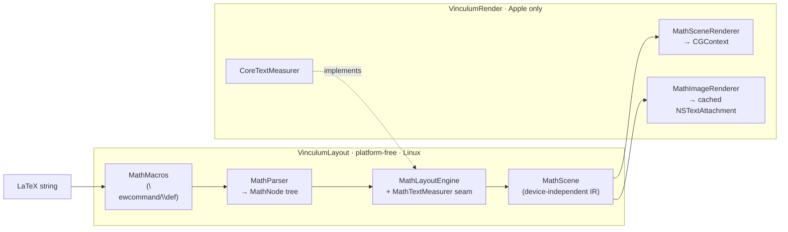

# Vinculum

**Native LaTeX math typesetting for Apple platforms. Real glyph shapes, TeX
metrics, a device-independent scene IR — no MathJax, no KaTeX, no WebView,
zero dependencies.**

<!-- badges: replace with real shields once CI/tags are public -->


Vinculum parses LaTeX math into a TeX-style atom tree and typesets it with an
OpenType MATH font (bundled **Latin Modern Math**), reading its layout
constants — axis height, rule thickness, script scales, shifts — from the
font's MATH table the way Knuth's algorithm intends (Appendix G of *The
TeXbook*). Layout is platform-free and emits a device-independent
`MathScene` of positioned primitives — TeX's DVI in miniature — which a thin
CoreGraphics renderer turns into a baseline-aligned `NSTextAttachment` (or
draws into any `CGContext` you own).

*A vinculum is the bar in a fraction, the line over a root — the stroke that
binds an expression together.* Vinculum is the native math engine extracted
from [Quoin](https://github.com/clintecker/quoin), sibling to
[MermaidKit](https://github.com/clintecker/MermaidKit).

---

## Why native?

If you render math in a native app today, you are usually embedding
**KaTeX or MathJax in a `WKWebView`**, or reaching for **[iosMath]**. Vinculum
is a third option with different trade-offs.

**vs. KaTeX / MathJax in a WebView**

- No WebView. No JavaScript runtime, no HTML/CSS reflow, no bridging layer,
  no web-content process to spin up per equation.
- Output is a **`NSTextAttachment`** that flows inline in an `NSTextView` /
  `UITextView` / `TextKit` layout, sharing the text system's baseline,
  selection, and line-breaking — a WebView snapshot never does.
- Deterministic, headless-testable geometry (see the golden-image suite),
  instead of pixels that depend on a web engine version.
- Trade-off: Vinculum implements a **curated subset** of LaTeX math, not the
  whole of KaTeX. If you need every macro package, a WebView still wins.

**vs. iosMath**

- Swift 6, strict concurrency, `Sendable` layout; macOS + iOS + visionOS +
  tvOS from one package (iosMath is Objective-C, iOS/macOS).
- A **device-independent scene IR** and an injected measurer seam, so the
  entire layout stage builds and unit-tests on **Linux**, headless.
- A `\newcommand`/`\def` macro processor and a document-scoped model.

**vs. rendering to a static image on a server** — Vinculum runs on-device,
offline, private. Nothing leaves the machine.

[iosMath]: https://github.com/kostub/iosMath

---

## Installation

Swift Package Manager. Add the dependency:

```swift
// Package.swift
dependencies: [
    .package(url: "https://github.com/clintecker/Vinculum.git", from: "0.5.0"),
]
```

Then pick your product(s):

```swift
.target(name: "MyApp", dependencies: [
    .product(name: "VinculumRender", package: "Vinculum"),  // Apple: parse + draw
    // .product(name: "VinculumLayout", package: "Vinculum"), // platform-free layout only
])
```

- **VinculumRender** — Apple platforms. Everything below, including the
  bundled font and the one-call attachment API.
- **VinculumLayout** — platform-free (Foundation only, builds on Linux):
  parsing, macros, and all typesetting geometry, emitting a `MathScene`. Use
  it alone if you supply your own measurer and renderer.

---

## Quick Start

One call turns LaTeX into an inline attachment for a text view:

```swift
import VinculumRender

// Returns nil when the LaTeX contains unsupported commands, so the host keeps
// its own fallback and a document never renders half-broken.
let attributed = MathImageRenderer.attachmentString(
    latex: #"\frac{-b \pm \sqrt{b^2 - 4ac}}{2a}"#,
    display: true,           // display style (stacked limits, larger parts)
    mathTheme: .light,       // .light / .dark / your own
    baseSize: 15)            // point size the surrounding text uses

if let attributed {
    textView.textStorage?.append(attributed)   // flows on the text baseline
}
```

Prefer to drive the pipeline yourself? Layout is platform-free and returns a
device-independent `MathScene`; you decide where to draw it:

```swift
import VinculumLayout   // parse + layout
import VinculumRender   // CoreText measurer + CGContext renderer

let node = MathParser.parse(#"\sum_{i=1}^{n} i^2"#)
guard MathParser.isFullySupported(node) else {
    // name the culprit for a fallback caption:
    // MathParser.unsupportedCommands(in: node)  →  ["\\foo", …]
    return
}

let engine = MathLayoutEngine(measure: CoreTextMeasurer.make(), baseSize: 15)
let scene  = engine.layout(node, display: true)   // MathScene: width/ascent/descent + primitives

// Draw into any y-up CGContext (an image, a PDF page, a custom view):
MathSceneRenderer.draw(scene, theme: .dark, in: cgContext, at: penPoint)
```

`MathImageRenderer.attachmentString` gives you the cached attachment.
`MathSceneRenderer.draw` is the primitive you build images or PDF pages from —
Vinculum ships no PDF convenience wrapper; you own the context.

---

## Gallery

Vinculum renders the everyday math people actually write. To generate a
labeled poster gallery (LaTeX source beside its native render), point the
gallery test at an output directory:

```bash
VINCULUM_GALLERY_DIR=/tmp/vinculum-gallery \
  swift test --filter GalleryGenerator/testGenerateGallery
```

It writes posters covering:

| Poster | Shows |
| --- | --- |
| `01-core.png` | Fractions, roots, sub/superscripts, big operators with stacked limits |
| `02-structures.png` | Auto-sized `\left…\right` fences, matrices, `cases`, `aligned` |
| `03-notation.png` | Accents, `\binom`, `\overbrace`/`\underbrace`, `\xrightarrow`, `\substack`, alphabets, color |
| `04-equations.png` | Quadratic formula, Euler's identity, Schrödinger, Bayes, Maxwell, the zeta functional-product |
| `05-macros.png` | Document-scoped `\newcommand` in action |
| `06-symbols.png` | Standalone delimiters and the extended symbol set |

> The repo also carries ~42 golden reference PNGs under
> `Tests/fixtures/math-golden/` (one per construct: `quadratic.png`,
> `integral.png`, `pmatrix.png`, `mathbb.png`, `overbrace.png`, …) that the
> render tests diff against. Drop generated posters into `docs/images/` if you
> want them inlined here.

Example expressions, all natively rendered:

```latex
x = \frac{-b \pm \sqrt{b^2 - 4ac}}{2a}
e^{i\pi} + 1 = 0
\int_{0}^{\infty} e^{-x^2}\, dx = \frac{\sqrt{\pi}}{2}
\zeta(s) = \sum_{n=1}^{\infty} \frac{1}{n^s} = \prod_{p} \frac{1}{1 - p^{-s}}
\nabla \times \vec{B} = \mu_0 \vec{J} + \mu_0 \epsilon_0 \frac{\partial \vec{E}}{\partial t}
\begin{pmatrix} a & b \\ c & d \end{pmatrix}
```

---

## Support Matrix

Native = renders with real geometry. Everything unsupported degrades to a
named source fallback (`isFullySupported` returns `false`; the render API
returns `nil`) — never a broken half-render. Full detail with examples in
[docs/COVERAGE.md](docs/COVERAGE.md).

| Feature | Status | Notes |
| --- | :---: | --- |
| Fractions `\frac`, `\cfrac` | ✅ | `\cfrac` lays out as a plain nested fraction |
| Roots `\sqrt`, `\sqrt[n]{}` | ✅ | Optional degree |
| Sub/superscripts `^` `_` | ✅ | Nested, both, on any atom |
| Big operators with limits | ✅ | `\sum \prod \bigcup \bigcap` stack limits in display; `\int \oint` keep side-scripts (TeX `\nolimits`) |
| Named operators `\lim \max \min \sup` | ✅ | Stack their limit underneath in display (`\lim_{x\to0}`) |
| Symbols & Greek (~200 commands) | ✅ | Correct TeX atom classes → real inter-atom spacing |
| Matrix environments | ✅ | `pmatrix bmatrix Bmatrix vmatrix Vmatrix matrix`, `cases`, `aligned`/`align`/`gather`/`split`, `substack` |
| Math alphabets | ✅ | `\mathbb \mathcal \mathscr \mathfrak \mathsf \mathtt \mathbf \boldsymbol` (Letterlike holes handled) |
| Accents | ✅ | Point (`\hat \vec \bar \dot …`), stretchy (`\widehat \widetilde`), rules (`\overline \underline`) |
| `\binom` / `\dbinom` / `\tbinom` | ✅ | Renders; forced size is ignored (see below) |
| `\overbrace` / `\underbrace` + labels | ✅ | Drawn brace with `^`/`_` annotation |
| `\xrightarrow` / `\xleftarrow` | ✅ | Stretchy, with over `{}` and under `[]` labels |
| `\boxed`, `\phantom` family | ✅ | `\phantom \hphantom \vphantom` |
| `\color` / `\textcolor` | ✅ | Braced `{name}{body}` form; named + `#rrggbb` |
| `\text \mathrm \textrm \operatorname` | ✅ | Upright; interior spaces preserved (`\text{if } x`) |
| Primes `f'`, `f''` | ✅ | Render as raised primes, coalesced |
| Direct Unicode math (`∫ ∑ ≤ α`) | ✅ | Classed like its command spelling |
| `\newcommand \renewcommand \def` | ✅ | Document-scoped, `#1…#9`, recursion-capped |
| Spacing `\, \: \; \! \quad \qquad` | ✅ | |
| `\dfrac` / `\tfrac` / `\dbinom` / `\tbinom` | ✅ | Force display/text style regardless of context |
| `\big \Big \bigg \Bigg` (+`l`/`r`/`m`) | ✅ | Enlarge the delimiter 1.2–3×, with opening/closing/relation spacing |
| `\pmod` / `\bmod` / `\pod` | ✅ | `a \equiv b \pmod{n}`, `a \bmod n` |
| `\genfrac` (general 5-arg form) | ❌ | Not parsed (only `\binom` uses the node internally) |
| `array` column specs & rules | ✅ | `{l c r \| c}` alignment + `\|` vertical rules + `\hline`/`\cline` — augmented matrices, bordered tables |
| `\cancel` / `\bcancel` / `\xcancel`, `\not` | ✅ | Diagonal strike-through; `\not` slashes any relation (`\not\subset` → ⊄) |
| Extended big operators | ✅ | `\iiint \oiint \coprod \bigsqcup \bigvee \bigwedge \bigoplus \bigotimes \bigodot …` |
| `\operatorname*` | ❌ | Parses/renders upright; `*` limit-stacking not honored yet |
| Cramped-style script lowering | ❌ | Not modeled |

⚠️ = accepted but semantics not fully honored. ❌ = degrades to fallback.

---

## Architecture

Vinculum mirrors TeX's device-independent split (and MermaidKit's
layout/render seam): **layout decides *what* to draw; a renderer decides
*how*.**



- **VinculumLayout** (Foundation only, Linux-buildable) owns parsing, macro
  expansion, and *all* typesetting geometry. `MathLayoutEngine` measures
  glyphs through an injected `MathTextMeasurer` closure and emits a
  `MathScene` of positioned primitives (`MathElement`: glyph runs, filled
  rules, stroked paths) in `MathColor`. No CoreText, no CoreGraphics — just
  geometry. The font's MATH-table constants live in `MathConstants`;
  Vinculum's own drawing proportions (radical hook, brace arcs, arrowhead)
  live in `MathLayout`. Every number is named.
- **VinculumRender** (Apple only) is the thin platform seam:
  `CoreTextMeasurer` implements the measurer via `CTLine`, `MathSceneRenderer`
  draws a scene into a `CGContext`, `MathFont` bundles Latin Modern Math,
  `MathTheme` is the host coupling (ink color + appearance), and
  `MathImageRenderer` orchestrates measure → layout → render into a cached
  attachment.

The measurer seam is why layout is headless- and Linux-testable: unit tests
inject a mock measurer and assert on exact geometry, no display required.
Deep dive in [docs/ARCHITECTURE.md](docs/ARCHITECTURE.md).

---

## The one seam: `MathTheme`

Math is monochrome ink on a transparent attachment, so the host coupling is
tiny — a color and the appearance it targets:

```swift
struct MathTheme {
    let ink: PlatformColor      // every stroke/glyph, unless \color overrides a subtree
    let prefersDark: Bool       // pins the appearance while rasterizing + keys the cache
}
```

Use `.light` / `.dark`, or build one from your design system. `\color` /
`\textcolor` override the ink per-subtree during layout. That's the whole
surface — see [docs/INTEGRATION.md](docs/INTEGRATION.md).

---

## Platforms

- **macOS 14+, iOS 17+, visionOS 1+, tvOS 17+** — full package (VinculumRender).
- **Linux** — VinculumLayout only (parsing + geometry; supply your own
  measurer/renderer).
- Swift 6 language mode, strict concurrency. Zero third-party dependencies.

> Not Mac Catalyst-tuned: on Catalyst `canImport(AppKit)` is true, so the
> AppKit path compiles but is untested there.

---

## Performance

- **Renders are cached** by content + theme + size (`NSCache`), so repeated
  layout of the same equation is a dictionary hit.
- Layout is allocation-light struct geometry with no WebView spin-up — the
  cost is one CoreText line measurement per glyph run plus arithmetic.
- The parser is bounded: a linear pre-scan caps recursion (adversarial
  `{{{…` or `\begin` nesting degrades to fallback instead of overflowing the
  stack) and macro expansion has a hard budget.

---

## Contributing

Adding a command touches three places — a `MathParser` case, a `Layout+*`
builder, and (for a symbol) a `MathSymbolTable` entry. Layout changes are
verified headless with a mock measurer; render changes diff against the
golden-image suite. See [CONTRIBUTING.md](CONTRIBUTING.md) and the
"add a command" walkthrough in [docs/ARCHITECTURE.md](docs/ARCHITECTURE.md).

---

## License

- **Code:** MIT © 2026 Clint Ecker ([LICENSE](LICENSE)).
- **Bundled font:** Latin Modern Math is licensed under the **GUST Font
  License (GFL)**, an OFL-style license — see
  `Sources/VinculumRender/Resources/GUST-FONT-LICENSE.txt` and
  `LatinModernMath-LICENSE.txt`. The GFL permits redistribution and embedding.
