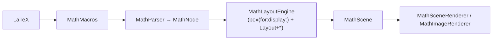

# TeX Appendix G → Vinculum Implementation Map

An honest, rule-by-rule audit of Knuth's math typesetting algorithm
(*The TeXbook*, Appendix G, "Generating Boxes from Formulas") against what
Vinculum's layout engine actually does. This is the document that keeps the
README honest: each rule is marked **Implemented**, **Partial**,
**Deviation** (deliberate, explained), or **ABSENT**.

It is a living document. [IMPLEMENTATION_PLAN.md](IMPLEMENTATION_PLAN.md)
phases land against it — a phase isn't done until its rules here flip
status. Audited at v0.23.0 (Phase 0 baseline).

Credit where due: the format follows iosMath's `ALGORITHM.md`, the best
artifact in that codebase.

---

## 1. Big picture

### 1.1 Pipeline

Vinculum has no separate "finalize" pass: binary→ordinary reclassification
(Rules 5/6) runs inside the engine (`reclassifyBinaries`,
`MathLayoutEngine.swift`), and everything else happens in the single
recursive `box(for:)` descent. Where TeX emits a horizontal list, Vinculum
emits a `MathBox` of positioned `MathElement`s.

### 1.2 Styles — **Implemented (Phase 2)**

`MathStyle` (display/text/script/scriptScript, `MathStyle.swift`) threads
through every builder, with the engine's separate `cramped` flag giving the
full eight-style lattice. Successor maps follow TeX: `scriptStyle` (D,T→S;
S,SS→SS) and `fractionStyle` (D→T, T→S, S→SS). Script descent multiplies
size by `scriptSizeRatio` — 70% from text, then only down to the 50%
scriptscript floor (not compounding 0.7ⁿ shrink). `\displaystyle`,
`\textstyle`, `\scriptstyle`, `\scriptscriptstyle` parse statefully (rest
of group, like stateful `\color`) and force both style and its implied
size; `\genfrac`'s style argument honors all four values.

Cramping propagates as before: radicands, denominators, and subscripts set
`cramped`, selecting `superscriptShiftUpCramped`.

### 1.3 Font parameters — **Implemented (Phase 1)**

TeX reads σ/ξ parameters from the font; so does Vinculum now.
`MathTableParser` (`VinculumLayout`, platform-free, fixture-tested on raw
committed `MATH` bytes) parses the full 56-value `MathConstants` sub-table
into `MathFontConstants`, and the `MathGlyphInfo` sub-table (per-glyph
italic corrections, top-accent attachment points, extended shapes, cut-in
kern staircases) into `MathGlyphInfo`. The engine carries a
`MathFontConstants` instance — parsed from the live font by the renderer
(`MathFont.constants`), or the `.latinModern` preset headless. The preset
is pinned three ways: live font ↔ fixture bytes ↔ fontTools ground truth.

The Phase 1 oracle caught **three mistranscriptions** in the old hardcoded
constants: `spaceAfterScript` 0.041 → font 0.056; `radicalVerticalGap`
0.148 was the *display* value (text is 0.050, now style-selected in
`radicalBox`); `stackGapMin` 0.150 → font 0.120. The old `MathConstants`
enum is deprecated. Note: `MathGlyphInfo` is *parsed* but not yet
*consumed* — that's Phases 3–4. Latin Modern Math ships no MathKernInfo
(fontTools-verified); kern staircases are exercised with synthetic bytes
until STIX Two arrives in Phase 7.

Vinculum's own drawing proportions (radical hook, brace arcs, arrowheads,
fraction part-scales) live separately in `MathLayoutMetrics.swift` and are
deliberately not TeX numbers — e.g. fraction part-scales 0.9/0.8 instead
of TeX's 1.0/0.7, documented there as a legibility choice.

---

## 2. Rule-by-rule

### Rule 2 — mu-glue and kerns — **Implemented (fixed values)**
`\, \: \; \! \quad \qquad \mkern \kern \hspace` produce spacing in
mu = em/18 (`MathLayoutMetrics.swift`). `\nonscript` is ABSENT (moot until
the style lattice exists). Thin/med/thick are fixed 3/4/5 mu.

### Rule 3 — style items — **Implemented (Phase 2)**
All four style commands, stateful to the group; `.mathStyle(base:style:)`
forces style + implied size (`\dfrac`/`\tfrac`, `\genfrac` styles 0–3).

### Rule 4 — `\mathchoice` — **ABSENT** (degrades to fallback, documented in COVERAGE.md)

### Rules 5/6 — Bin↔Ord reclassification — **Implemented**
`reclassifyBinaries` (`MathLayoutEngine.swift`) retypes a binary with no
left operand, or one following Bin/Rel/Open/Punct/Op, to ordinary, and a
binary before Rel/Close/Punct likewise (TeXbook p.170 chart).

### Rule 8 — `\vcenter` — **ABSENT**

### Rules 9/10 — `\overline`/`\underline` — **Implemented**
Rule + gap from `overbarVerticalGap`/`underbarVerticalGap` and rule
thickness constants (`Layout+Decorations.swift`); inner cramped.

### Rule 11 — radicals — **Partial / Deviation (scheduled)**
Radicand laid out cramped with `radicalVerticalGap` clearance and
`radicalRuleThickness` vinculum — the *vertical* arithmetic is TeX-shaped.
But the surd itself is a **hand-stroked polyline**
(`Layout+Radicals.swift`, proportions in `MathLayout.Radical`), never the
font's √ glyph, its size variants, or an assembly. Degree placement uses
Vinculum proportions, not `RadicalKernBefore/AfterDegree` and the 60%
raise. *Phase 5 adopts the real glyph; Phase 1 supplies its constants.*

### Rule 12 — accents — **Implemented (Phase 4, minus width variants)**
Accent x comes from the font's `topAccentAttachment` points (base minus
accent, via the typography provider; advance-center fallback) — strictly
better than TeX's `\skewchar`. Vertically the accent hugs the base's ink
but never sinks below the font's `AccentBaseHeight` seat
(δ = min(h, AccentBaseHeight)). Scripts on a single-character accentee
promote onto the character (`\hat{f}^2` puts the ² on the f). Remaining:
stretchy accents still *scale* toward the char width (clamped 0.7–1.6×)
instead of walking horizontal width variants — Phase 5's horizontal
machinery covers that.

### Rule 13 — large operators — **Partial / Deviation**
Display-style big operators are **scaled 1.35×**
(`MathLayout.displayOperatorScale`, comment admits "TeX swaps in the
display-size glyph; we scale instead") — no variant swap, no
`DisplayOperatorMinHeight`. Limits stacking is implemented with
`upperLimitBaselineRiseMin`/`lowerLimitBaselineDropMin`; integrals are
correctly `\nolimits` by default; the `\lim` family stacks. Italic
correction on operator scripts is ABSENT (see Rule 17). *Phases 3 and 6.*

### Rule 14 — Ord runs, ligatures, kerns — **Partial**
Adjacent symbols share glyph runs via the measurer. Math ligatures and
inter-glyph math kerns: ABSENT (also absent in iosMath; low priority).

### Rule 15 — fractions — **Implemented (Phase 2)**
Rules 15b–d land font-true: with a rule, numerator/denominator shifts come
from the `FractionNumerator/Denominator[DisplayStyle]Shift` pairs and
clearance from `FractionNum/DenomGapMin` (display: 3ξ₈, text: ξ₈); without
a rule (`\atop`, `\binom`), the `StackTop/Bottom[DisplayStyle]Shift` pairs
and `Stack[DisplayStyle]GapMin`. The 1.35 display boost and the hand-tuned
`ruleGap`/`atopGap` numbers retired. `\cfrac` uses the display constants.
Remaining deviation: part-scales 0.9/0.8 (deliberate, see §1.3);
`\above`/`*withdelims` unparsed.

### Rule 16 — retype to Ord — **Implemented** via each builder returning a classed box consumed by the spacing walk.

### Rule 17 — nucleus conversion + italic correction — **Implemented (Phase 3)**
Per-glyph italic correction flows through the injected
`MathGlyphTypographyProvider` (backed by the font's
MathItalicsCorrectionInfo): the superscript shifts right by δ while the
subscript stays at the advance; a large operator instead tucks its
subscript δ left under the overhang (∫'s δ is 0.332 em in LM Math); and
stacked limits split ±δ/2 (Rule 13a). The `\scriptspace` analog
(`SpaceAfterScript`, the correct 0.056 em) now trails the scripts instead
of preceding them. Remaining gap: no unconditional italic-correction kern
between adjacent unscripted symbols (same as iosMath).

### Rule 18 — scripts — **Implemented (Phase 3), exceeds iosMath**
The full 18a–f ladder: style shift constants for character bases and the
σ₁₈/σ₁₉ baseline drops (`Superscript/SubscriptBaselineDrop`) for composite
nuclei, the `SuperscriptBottomMin`/`SubscriptTopMax` clamps (18b–c), the
`SubSuperscriptGapMin` + `SuperscriptBottomMaxWithSubscript` collision
resolution (18d–e), the δ split (18f), and — beyond TeX and beyond every
native library — **MathKernInfo cut-in kerning**: scripts sample the base
glyph's corner staircase at their near edge and tuck in by the kern. LM
Math ships no kern data (staircases exercised with synthetic bytes); STIX
Two in Phase 7 lights this up for real. Ink-clearance floors are retained
so exponents clear tall bases' ink.

### Rule 19 — `\left…\right` — **Partial / Deviation**
Auto-sizing exists; tall `( ) [ ] { }` step through MATH size variants
(gated to a verified set), everything else point-scales (fat strokes,
flagged in COVERAGE.md). The TeX sizing formula
(`\delimiterfactor` 901/500, `\delimitershortfall`) is not used; Vinculum
sizes to the body directly. No glyph assembly. `\middle`, `\big…\Bigg`:
implemented. *Phases 5–6.*

### Rule 20 — inter-atom spacing — **Implemented (Phase 2, minus Inner)**
A hand-written switch over 7 atom classes (`spacing(between:and:style:)`,
`MathLayoutEngine.swift`) with thin/med/thick = 3/4/5 mu, driven by real
atom classes from `MathSymbolTable`. Medium and thick vanish in script
styles (TeX's parenthesized chart entries); thin applies everywhere.
ABSENT: the `Inner` class as a distinct row/column. Fixed muskips (same
as iosMath).

### Rules 21/22 — line-break penalties, `\mathsurround` — **ABSENT**
Math lays out atomically; breaking is the host's problem. Automatic
breaking is a Phase 9 stretch goal.

---

## 3. Constants ledger (post-Phase 1)

**Read from the font at runtime:** the full 56-value `MathConstants`
sub-table (`MathFontConstants`), the `MathGlyphInfo` sub-table (italic
corrections, topAccentAttachment, extended shapes, kern staircases), and
the vertical size-variant lists for the verified delimiter set.

**Parsed but not yet consumed by layout:** everything in `MathGlyphInfo`
(Phases 3–4); the constants the engine doesn't select yet —
SubSuperscriptGapMin, SuperscriptBottomMin, SubscriptTopMax,
SuperscriptBottomMaxWithSubscript, σ₁₈/σ₁₉ baseline drops,
DisplayOperatorMinHeight, RadicalKernBefore/AfterDegree,
RadicalDegreeBottomRaisePercent, FractionNum/DenomGapMin pairs, the
stretch-stack and skewed-fraction sets (Phases 2–6).

**Still missing from the parser:** GlyphAssembly part records +
MinConnectorOverlap (Phase 5).

**Vinculum's own numbers (deliberate, stay):** `MathLayoutMetrics.swift` —
radical polyline proportions (until Phase 5), brace arcs, arrowheads,
fraction part-scales and side padding, delimiter step factors.

---

## 4. Gap summary → plan mapping

| Gap | Rule(s) | Phase |
| --- | --- | --- |
| ~~Constants not read from font~~ **done** | §1.3 | 1 ✓ |
| ~~No style lattice / script spacing rule~~ **done** | §1.2, 3, 20 | 2 ✓ |
| ~~No italic correction~~ **done** | 17, 18f, 13 | 3 ✓ |
| ~~No cut-in kerning~~ **done** (mechanics; live data arrives with STIX Two) | 18 | 3 ✓ |
| ~~Accent attachment points~~ **done** (width variants → 5) | 12 | 4 ✓ |
| No glyph assembly; polyline radical; scaled tall fences | 11, 19 | 5 |
| Operators scaled not variant-swapped; Rule 19 formula | 13, 19 | 6 |
| `\mathchoice`, `\vcenter`, `\above`, `\nonscript` | 4, 8, 15, 2 | backlog |
| Line breaking | 21 | 9 (stretch) |

---

## 5. Audit checklist (run after layout changes)

- [ ] Every `Layout+*` builder sets width/ascent/descent on its box before
      returning; ink metrics where scripts can attach.
- [ ] Every recursive `box(for:)` call passes the right `display:`/`cramped:`
      (numerator not cramped, denominator/radicand/subscript cramped).
- [ ] New symbols carry a real `MathAtomClass` in `MathSymbolTable` — an
      `.ordinary` default silently breaks Rule 20 spacing.
- [ ] Goldens re-blessed knowingly, never wholesale; the coverage ratchet
      stays green in both directions.
- [ ] This document's statuses still tell the truth.
