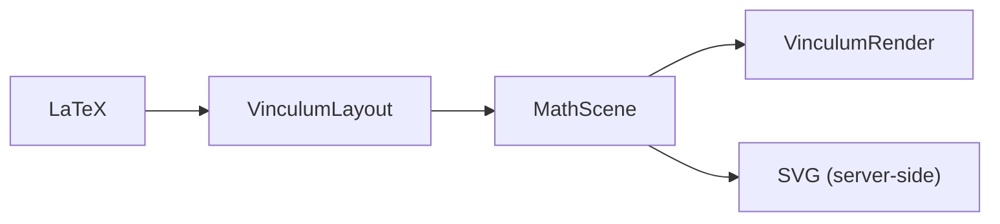
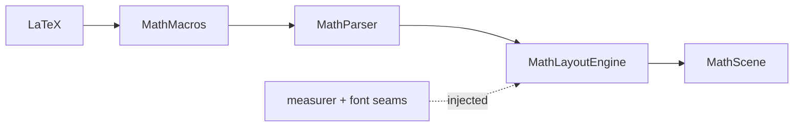
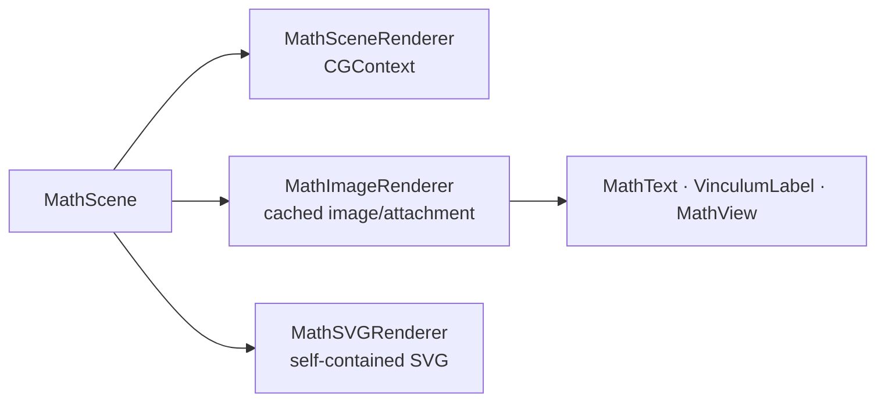

# Vinculum Architecture

Vinculum is built on one idea, borrowed from TeX itself: **separate *what* to
draw from *how* to draw it.** TeX compiles a document to a device-independent
`DVI` file — a list of "put this glyph here, draw this rule there" — and a
separate driver rasterizes it for a specific device. Vinculum does the same
at the scale of a single expression: `MathLayoutEngine` produces a
device-independent `MathScene`, and `MathSceneRenderer` turns it into pixels.

This split is also MermaidKit's (layout vs. render), and it is why the entire
layout stage builds and unit-tests on Linux with no display.

---

## The two products

| | `VinculumLayout` | `VinculumRender` |
| --- | --- | --- |
| Depends on | Foundation only | VinculumLayout + CoreText/CoreGraphics/AppKit/UIKit |
| Platforms | macOS, iOS, visionOS, tvOS, **Linux** | Apple only |
| Owns | parsing, macros, **all typesetting geometry**, the MATH-table constants | measuring, drawing, the bundled font, the theme, the MATH-table delimiter provider, the cached attachment |
| Output | a `MathScene` (positioned primitives) | pixels / an `NSTextAttachment` |

`VinculumLayout` never imports CoreGraphics or CoreText. It uses only
Foundation geometry types (`CGPoint`, `CGRect`, `CGFloat`), which exist on
Linux, so it is fully portable and headless. Note that even the font's
OpenType MATH-table numbers live in the layout product as pure data
(`MathFontConstants`, parsed by the platform-free `MathTableParser`) — the
layout stage needs them, and it must build on Linux — while the font
*object* those numbers come from lives in the renderer.

---

## The pipeline

The high-level shape — two products meeting at one IR:



### The layout pipeline (VinculumLayout · platform-free · Linux-tested)



- **MathMacros** — the host-driven pre-pass: collects `\newcommand` /
  `\def` definitions across the whole document (they are document-scoped),
  expands each block, strips the definitions.
- **MathParser** — tokenizer → recursive descent → `MathNode` tree.
  Unknown input becomes `.unsupported` leaves; the parse never fails and
  recursion is depth-bounded.
- **MathLayoutEngine** — TeX Appendix G over the injected seams
  (`MathFontServices`: measurer, font constants, delimiter variants,
  glyph assembly, per-glyph typography, wide accents). Composes
  `MathBox`es into positioned `MathElement`s.

### The render products (from one scene)



- **MathSceneRenderer** — draws a scene into any y-up `CGContext`
  (requires the font the scene was measured with).
- **MathImageRenderer** — measure → layout → rasterize, cached by
  content + theme + size + font; feeds the attachment API, the document
  pipeline (`MathText`), and both views.
- **MathSVGRenderer** — platform-free; headless scenes become
  self-contained SVG (server-side rendering).


The macro pre-pass is deliberately outside the parser: definitions are
*document-scoped* (a `\newcommand` in one math block applies to every block),
so the host collects them across the whole document once, then expands each
block's source before handing the plain LaTeX to the parser or the renderer.

---

## The device-independent scene IR

`MathScene` (in `MathScene.swift`) is the contract between the two products:

```swift
public struct MathScene: Sendable {
    public var width: CGFloat
    public var ascent: CGFloat      // above the baseline
    public var descent: CGFloat     // below the baseline
    public var elements: [MathElement]
    public var height: CGFloat { ascent + descent }
    public var hasExplicitColor: Bool { elements.contains { $0.color != nil } }
}
```

The scene's coordinate system is **y-up with the origin on the expression's
baseline**. `ascent`/`descent` are exactly what an inline attachment needs to
sit on a text baseline. `hasExplicitColor` lets the renderer emit a *tintable
template image* when no `\color` appears — so selected math inverts and
dark-mode adapts with no re-render.

`MathElement` is the primitive vocabulary — **four cases**, enough to draw all
of math:

```swift
public enum MathElement: Sendable {
    case glyphs(text: String, size: CGFloat, mono: Bool, origin: CGPoint, color: MathColor?)
    case rule(CGRect, color: MathColor?)                 // fraction bars, over/underline, box sides
    case stroke(path: [PathOp], width: CGFloat,          // radical signs, braces, arrows, box borders
                cap: StrokeCap, join: StrokeJoin, color: MathColor?)
    case glyph(id: UInt16, size: CGFloat, origin: CGPoint, color: MathColor?)   // MATH-table delimiter size variant
}
```

- `glyphs.text` is already the *final* glyph string. Style (italic/bold, math
  alphabets) is baked in by remapping to Mathematical-Alphanumeric codepoints
  during layout (`MathLayoutEngine.mathVariant`, `MathAlphabet`), so the
  renderer needs no style flags — it just draws the string in the math font.
- `mono: true` selects the monospace fallback used only for `.unsupported`
  source, keeping unknown input legible.
- **`glyph(id:)`** is new: a single delimiter *size variant* addressed by its
  raw font glyph ID (variant glyphs are usually unencoded, so a character
  string can't name them). It exists because a genuinely tall `(` should be
  the font's purpose-drawn taller cut — constant stroke weight — not the base
  glyph point-scaled, which fattens the stroke. See "Delimiter size variants"
  below. The renderer draws it with `CTFontDrawGlyphs`.
- `PathOp` (`move`/`line`/`quad`/`close`) and Vinculum's own `StrokeCap` /
  `StrokeJoin` enums keep strokes platform-free — CoreGraphics' `CGLineCap`
  isn't on every platform.

`MathColor` is platform-free sRGB. A `nil` color on any element means **"use
the theme ink"**; the renderer substitutes `MathTheme.ink` at draw time.
`\color{red}{…}` / `\color{#cc2222}{…}` resolve to a concrete `MathColor`
during layout (`MathColor.resolve` handles a named palette and `#rrggbb`),
and that color rides on the element — so themes and per-subtree color compose
without the renderer knowing anything about `\color`.

---

## The measurer seam — why layout is headless

Layout must know glyph widths and heights, which only a real font system can
give. Rather than import CoreText into the layout product, Vinculum **injects**
the measurement:

```swift
public typealias MathTextMeasurer =
    @Sendable (_ text: String, _ size: CGFloat, _ mono: Bool) -> GlyphMetrics

public struct GlyphMetrics: Sendable {
    public var width, ascent, descent: CGFloat
    public var inkAscent, inkDescent: CGFloat   // actual painted bounds → accent placement
}
```

`MathLayoutEngine` is constructed with a measurer (and, optionally, a delimiter
provider — see below):

```swift
let engine = MathLayoutEngine(measure: someMeasurer, baseSize: 15)
```

- On Apple platforms, `CoreTextMeasurer.make()` implements it via `CTLine`
  (typographic bounds + `CTLineGetImageBounds` for the ink extents accents
  need). It memoizes on `(text, size, mono)`: the parser emits one node per
  character, so an N×N matrix would otherwise re-measure each glyph N² times.
- In tests (and on Linux), a **mock measurer** returns synthetic metrics, so
  `MathLayoutTests` asserts on exact geometry — fraction bar position, script
  shift, matrix cell placement — with no display and no font.

The seam is the whole reason the layout geometry is unit-testable in CI on a
headless Linux runner.

---

## Delimiter size variants — the optional MATH-table seam

A second, **optional** seam mirrors the measurer:

```swift
public struct DelimiterShape: Sendable {
    public var glyphID: UInt16
    public var metrics: GlyphMetrics
}

public typealias MathDelimiterProvider =
    @Sendable (_ baseGlyph: String, _ minHeight: CGFloat, _ size: CGFloat) -> DelimiterShape?
```

Given a base fence glyph and a minimum height, the provider returns the
smallest discrete size variant that reaches it (with a shortfall heuristic:
a cut within 3% of the target beats a ≥1.3× jump), or `nil`. Two sibling
seams complete the stretch chain: `MathDelimiterAssemblyProvider` (an
assembled column of font parts — end caps + repeatable extenders — for
heights beyond the largest cut) and `MathAccentVariantProvider` (horizontal
width variants for `\widehat`-family accents). All default to `nil`, so
headless / Linux layout is completely unaffected — it point-scales, as it
always did.

**Where they're consulted.** `stretchedFence` (in `Layout+Delimiters.swift`)
tries variants, then assembly, then scaling, for every covered delimiter;
`radicalBox` does the same for the surd (falling back to the hand-stroked
polyline only with no provider); display-style large operators swap in the
font's bigger cut at `DisplayOperatorMinHeight`; stretchy accents take the
widest horizontal cut not exceeding the accentee. The `\big…\Bigg` path
(`bigDelimiterBox`) still always scales — those are explicitly-sized lone
glyphs.

**How the providers are built (VinculumRender).** Every font's raw MATH
table is parsed ONCE, eagerly, when its `MathFont` loads — by
`MathTableParser` in VinculumLayout, which is platform-free and
fixture-tested on Linux against committed table bytes. The parse is fully
bounds-checked; any malformed sub-table degrades to "no data" and layout
falls back to scaling. `CoreTextDelimiterProvider.make(font:)` /
`.makeAssembly(font:)` / `.makeAccentVariants(font:)` wrap lookups into the
font's parsed `MathVariantsData` as the injected closures.

**Build engines through the factory.** On Apple platforms,
`MathLayoutEngine.make(font:baseSize:)` is the one correct construction: it
wires the measurer, the font's constants, and all provider seams in one
call. The bare `MathLayoutEngine(measure:baseSize:)` initializer exists for
headless hosts injecting their own seams — used directly, it deliberately
carries no font capabilities.

---

## Two kinds of constants: `MathConstants` vs. `MathLayout` / `MathSpacing`

Knuth's rule (Appendix G of *The TeXbook*) is that a math typesetter reads its
constants **from the font**, never from hand-tuned literals. Vinculum follows
it, and splits its numbers into two files accordingly. Both live in
`VinculumLayout` (the layout stage needs them and must build on Linux).

- **`MathFontConstants`** (`MathTableParser.swift`) — the full 56-value
  `MathConstants` sub-table of the OpenType MATH standard, **parsed from the
  live font at load** and carried by the engine as instance data
  (`engine.constants`). Headless hosts get the `.latinModern` preset — a
  fontTools-verified transcription of Latin Modern Math's values, test-pinned
  against committed raw table bytes — so Linux layout still uses TeX-true
  numbers. Alongside it, `MathGlyphInfo` carries the per-glyph data (italic
  corrections, accent attachment points, cut-in kern staircases) and
  `MathVariantsData` the variant ladders + glyph assemblies.
- **`MathLayout`** and **`MathSpacing`** (both in `MathLayoutMetrics.swift`) —
  proportions that have *no* font parameter because TeX delegates them to
  *glyphs* (the radical hook, the curly brace, the arrowhead) or to the *style
  lattice* (the D→T→S→SS shrink). Vinculum draws those shapes itself, so their
  vertices and scales are named and documented under `MathLayout.Radical`,
  `.Brace`, `.Arrow`, `.Fraction`, `.Grid`, … rather than left as bare
  literals. Inter-atom spacing is `MathSpacing`, in `mu` (1/18 em): thin 3mu,
  medium 4mu, thick 5mu.

The guiding invariant: **zero unexplained numbers in the builders.** If a
value has a font equivalent it is read from the font (`engine.constants`,
per-glyph typography, variants); otherwise it is a named `MathLayout` /
`MathSpacing` proportion with a comment saying why it has no font source.

---

## The atom-class spacing model

Vinculum spaces atoms the way TeX does — not by eyeballing gaps, but by
classifying each atom and looking up the pair in a table. Every `MathNode`
symbol carries a `MathAtomClass`:

```swift
enum MathAtomClass { case ordinary, largeOperator, binary, relation, opening, closing, punctuation }
```

`MathSymbolTable` assigns the class (e.g. `+` is `.binary`, `=` is
`.relation`, `∑` is `.largeOperator`, `(` is `.opening`). In `rowBox`, the
engine walks adjacent atoms and inserts spacing per
`MathLayoutEngine.spacing(between:and:)`, which encodes TeX's pair table
(TeXbook p. 170):

- Ord↔Op → thin (3mu)
- around Bin → medium (4mu)
- around Rel → thick (5mu)
- after Punct → thin

This is why `a+b` and `a=b` and `\sum x` all get *correct* — and different —
spacing, and why a directly-typed `∫x` behaves like `\int x`: `characterNode`
looks the raw glyph up in `glyphAtomClass` (the reverse of the symbol table) so
it gets the same class its command spelling would.

### Binary / unary reclassification

Before spacing, `rowBox` runs the class list through
`MathLayoutEngine.reclassifyBinaries` (TeXbook p. 170). A `.binary` atom with
no valid left operand — at the start of a row, or after Bin/Op/Rel/Open/Punct —
is really a unary sign, so it becomes `.ordinary`; and a `.binary` immediately
left of a Rel/Close/Punct becomes `.ordinary` too. This is what sets a *thick*
space after `=` and a *tight* unary minus in `x = -1`, instead of a medium
space around the minus. `nil` classes (explicit spacing, unsupported leaves)
don't participate and don't reset the walk.

---

## Sub-contexts: how `\color` and cramped style thread through layout

`MathLayoutEngine` is a `struct`, and it carries two pieces of ambient state
that the recursive builders modify by **making a copy** — never by mutating
shared state:

- `colorOverride: MathColor?` — the active `\color` for the current subtree.
  Every primitive helper (`glyphBox`, `rule`, `stroke`) stamps it onto the
  element it emits. The `.styled` case copies `self`, sets
  `sub.colorOverride = MathColor.resolve(color) ?? colorOverride` (so nested
  `\color` nests), and lays the child out through the copy.
- `cramped: Bool` — TeX's cramped style, set under a radical, in a denominator,
  and on a subscript. In cramped style superscripts shift up *less*
  (`superscriptShiftUpCramped`), so an exponent inside √(x²) or a denominator
  rides lower. It propagates the same way — a sub-context copy with
  `cramped = true`.

Because the engine is a value type, these sub-contexts are cheap and can't leak
across siblings: a `\color` on one operand never bleeds into the next.

---

## The `MathNode` tree (the AST)

`MathParser.parse` produces an `indirect enum MathNode` — deliberately close to
TeX's own row-of-atoms model. There are currently **24 cases**:

| case | what it is |
| --- | --- |
| `symbol(String, MathAtomClass, style:)` | one glyph run + its atom class + italic/roman/bold |
| `row([MathNode])` | horizontal sequence |
| `fraction(numerator:denominator:)` | `\frac` |
| `cfrac(numerator:denominator:align:)` | continued fraction, full display size, l/c/r |
| `radical(degree:radicand:)` | `\sqrt[n]{…}` |
| `scripts(base:subscript:superscript:)` | sub/superscripts (and stacked limits) |
| `delimited(left:body:right:)` | `\left…\right` auto-sized fences |
| `fenced(fences:segments:)` | `\left…\middle…\right` (fences = segments+1) |
| `matrix(rows:left:right:style:)` | any `\begin{…}` grid (matrix/cases/aligned/substack/array) |
| `functionName(String)` | upright `sin`, `log`, … (spaced as a large operator) |
| `limitsOperator(base:)` | `\operatorname*`-style op that takes stacked limits |
| `classified(base:atomClass:)` | `\mathbin`/`\mathrel`/`\mathop`/… — transparent, only class changes |
| `ruleBox(width:height:)` | `\rule{w}{h}` solid rectangle |
| `raised(base:shift:)` | `\raisebox` vertical shift |
| `colorbox(base:background:border:)` | `\colorbox`/`\fcolorbox` filled (± framed) box |
| `space(Double)` | explicit em spacing |
| `accent(base:accent:)` | `\hat`/`\vec`/`\overline`/… (`MathAccent`) |
| `genfrac(top:bottom:hasRule:left:right:)` | generalized fraction (`\binom`, `\genfrac`) |
| `overUnder(base:over:under:kind:)` | over/underset, braces, stretchy arrows (`MathOverUnder`) |
| `decorated(base:decoration:)` | `\boxed`/phantom/cancel/smash/lap (`MathDecoration`) |
| `styled(base:color:)` | `\color`/`\textcolor` subtree |
| `mathStyle(base:display:)` | `\dfrac`/`\tfrac`/`\dbinom`/`\tbinom` forced style |
| `bigDelimiter(glyph:factor:atomClass:)` | `\big`…`\Bigg` lone sized fence |
| `unsupported(String)` | anything unrecognized — degrades to a source card, never throws |

The associated enums are worth knowing when reusing a node kind:
`MathAtomClass` (7 classes above), `MathSymbolStyle` {italic, roman, bold},
`MathMatrixStyle` {centered, cases, aligned, substack, array(`ArraySpec`)},
`MathDecoration` {boxed, phantom, hphantom, vphantom, cancel, bcancel, xcancel,
negation, smash, rlap, llap, clap}, `MathOverUnder` {plain, overbrace,
underbrace, rightarrow, leftarrow, over/under{Right,Left,LeftRight}Arrow,
over/underbracket, over/underparen}, and `MathAccent` {hat, check, tilde, bar,
vec, dot, ddot, breve, mathring, acute, grave, widehat, widetilde, widecheck,
overline, underline}. `ArraySpec` carries per-column alignment, the `|`
vertical rules, and `\hline`/`\cline` horizontal rules for `array`.

---

## How to add a new command

Adding a construct touches a small, well-defined set of places. The single most
important thing to know: **a new `MathNode` case must be added to FOUR
exhaustive `switch`es over `MathNode`**, and the compiler forces every one of
them (none has a `default:` for the node cases). Miss one and the build fails —
which is the point.

### The four exhaustive switches (for a new `MathNode` case)

1. **`MathLayoutEngine.box(for:size:display:)`** (`MathLayoutEngine.swift`) —
   the node → `MathBox` dispatch. Add a case that builds geometry (usually
   delegating to a builder in the matching `Layout+*.swift` extension).
2. **`MathLayoutEngine.atomClass(of:)`** (`MathLayoutEngine.swift`) — the
   spacing class the node contributes to a row. Return the right
   `MathAtomClass` (or `nil` if it shouldn't participate, like `.space`).
3. **`MathParser.isFullySupported`** (`MathDiagnostics.swift`) — recurse into
   the new case's children so the render API can gate on it. This is the gate
   `MathImageRenderer` checks before committing to a native render.
4. **`MathParser.unsupportedCommands`** (`MathDiagnostics.swift`) — recurse the
   same way so the fallback card can name any unsupported command *inside* the
   new node.

(If your case is a new `MathElement` rather than a `MathNode`, note
`MathElement.color` and `MathElement.translated(by:)` in `MathScene.swift` are
also exhaustive and must be extended — but new element kinds are rare.)

### Plus the parser, and (for a symbol) the table

- **Parser** — add a `case` in `MathParser.commandNode` that consumes the
  argument(s) and returns the node. Reuse an existing node kind if you can
  (accents, over/under, decorations, genfrac, classified all take variants);
  add a new `MathNode` case only if the shape is genuinely new (then you owe
  the four switches above).
- **Layout builder** — put the geometry in the matching `Layout+*.swift`
  extension. Build a `MathBox` from sub-boxes and primitives; use
  `engine.constants` for any value with a font source, otherwise a named
  `MathLayout` / `MathSpacing` proportion.
- **Tests** — a headless geometry assertion in `MathLayoutTests` (mock
  measurer) and, if it renders, a golden fixture the render suite diffs.

### The easy case: a new *symbol*

A plain symbol needs **none** of the four switches — it rides the existing
`.symbol` machinery. Add one row to `MathSymbolTable.symbolTable`:

```swift
"aleph": ("ℵ", .ordinary),
```

The parser's `default` case in `commandNode` looks unknown commands up in
`symbolTable` and emits `.symbol(glyph, class, style: .roman)`; layout draws
it, spacing falls out of the atom class, and because `glyphAtomClass` is the
reverse of this table, typing the raw glyph gets the same class for free. (For
a named operator like `\sin`, add to `functionNames` instead — the parser emits
`.functionName`.)

The parser's cardinal rule: **never fail.** Unknown commands become
`.unsupported` leaves so a document degrades to a named source card instead of
throwing.

---

## Rasterization and caching (`MathImageRenderer`)

`MathImageRenderer.attachmentString` is the orchestrator (macros already
expanded by the host):

1. Cache lookup keyed by `display | theme.fingerprint | baseSize | latex` —
   done **before** parsing, so a hit (positive *or* negative) costs no
   parse/layout.
2. On a miss: `MathParser.parse` → gate on `isFullySupported` (a negative
   cache entry with a `nil` image if not — remembered so a live editor doesn't
   re-parse unsupported input every keystroke).
3. Build the engine (display bumps `baseSize × 1.15`, and passes the
   `CoreTextDelimiterProvider`), lay out the scene, rasterize into an
   `NSImage`/`UIImage` at the scene's size + 2pt padding, pinning the theme's
   appearance (`.darkAqua`/`.aqua` on AppKit, the matching `UITraitCollection`
   on UIKit) so dynamic inks resolve correctly. When the scene has no explicit
   `\color`, the image is marked as a template so it tints/inverts for free.
4. Wrap the image in an `NSTextAttachment` whose `bounds` are offset by the
   scene descent, so it sits on the text baseline.

The cache is an `NSCache` (documented thread-safe) bounded by both count (512)
and pixel-byte cost (32 MB). `MathTheme.fingerprint` resolves the ink under the
same appearance used to draw, so two themes that differ only in ink can never
serve each other's cached renders.
