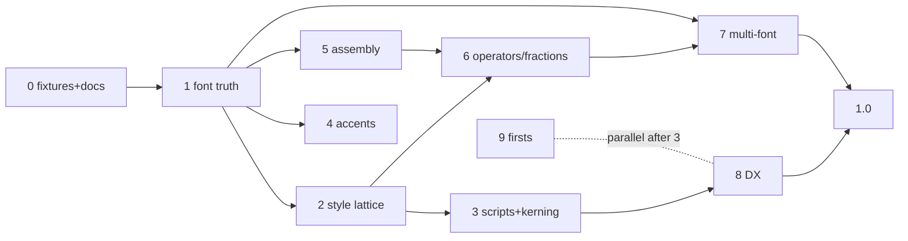

# Implementation Plan

The phase-by-phase, test-first execution of [ROADMAP.md](ROADMAP.md). Each
phase is independently shippable, ordered so that every phase's tests can be
written *before* its implementation, against infrastructure the previous
phase left behind.

---

## The TDD loop this repo already supports

Every phase runs the same four-ring loop, innermost first:

1. **Byte-level tests (Linux).** Parser work is tested against *committed
   fixture bytes* — the raw `MATH` table extracted from the bundled fonts
   into `Tests/fixtures/math-table/*.bin` — so table parsing is verified
   headless, no CoreText, no display.
2. **Geometry tests (Linux).** Layout behavior is asserted through the mock
   measurer in `Tests/VinculumLayoutTests/` as *exact numbers*: "with italic
   correction δ=0.031em on `f`, the superscript origin.x moves from A to
   A+δ." Write the failing geometry assertion first; it is the spec.
3. **Golden images (macOS).** Each visible change adds or re-blesses
   fixtures in `Tests/fixtures/math-golden/` (`VINCULUM_UPDATE_SNAPSHOTS=1`).
   A phase that claims "no visual change" must leave every golden green —
   that *is* the refactor test.
4. **The ratchet.** New capability promotes `.knownUnsupported` stress/golden
   entries to `.mustRender`; the suite fails if coverage silently improves
   or regresses. Each phase ends by ratcheting.

House rules for the plan:

- **Never regress the fallback contract.** Everything new is additive;
  unsupported input still degrades to a named fallback, never a half-render.
- **New knobs default off or default-equal.** Font-parsed constants must
  reproduce the hardcoded values before the hardcoded values retire.
- **One phase, one PR train.** Small commits inside a phase; the phase's
  exit criteria are the merge bar.

---

## Phase 0 — Truth and scaffolding (docs + fixtures, no behavior change)

**Goal.** An honest baseline and the fixtures later phases test against.

**Tests first.**
- A `MathTableFixtureTests` that loads each committed `.bin` fixture and
  asserts basic sanity (magic version `0x00010000`, non-empty). Trivial on
  purpose — it proves the Linux fixture path works.

**Steps.**
1. Add a tiny dev tool (a test-target utility, not shipped) that dumps a
   `CGFont`'s raw `MATH` table to `Tests/fixtures/math-table/
   latinmodern-math.bin`; commit the bytes (~10–60 KB).
2. Start `docs/ALGORITHM.md`: rule-by-rule Appendix G map of *current*
   Vinculum, gaps marked ABSENT — the audit this plan was derived from,
   kept current as phases land. (iosMath's ALGORITHM.md is the model.)
3. README honesty pass per ROADMAP.

**Exit.** Fixtures committed and loadable on Linux CI; ALGORITHM.md v1
merged; no golden churn.

---

## Phase 1 — Parse `MathConstants` + `MathGlyphInfo` from the font (Theme A)

**Goal.** Constants come from the font. The single highest-leverage phase.

**Design.** The binary parser moves/generalizes from
`Sources/VinculumRender/MathVariantTable.swift` into `VinculumLayout` as
`MathTableParser` (pure `Data` → data structs, Linux-buildable). Render
keeps only the 10-line "get table bytes from CGFont" shim. New parsed
products:

- `MathFontConstants` — the 56-value `MathConstants` sub-table (header
  offset 4, currently ignored).
- `MathGlyphInfo` — from header offset 6 (also currently ignored):
  italics-correction coverage, `topAccentAttachment`, and **MathKernInfo**
  records (parsed now, consumed in Phases 3–4).

**Tests first (this phase's trick).** The hand-transcribed literals in
`MathConstants.swift` (axisHeight 0.250, superscriptShiftUp 0.363,
scriptPercentScaleDown 0.70, …) become the *expected values*:

- `testParsedConstantsMatchTranscription()` — parse the LM Math fixture,
  assert every value the transcription has equals the parsed value (±1
  font-unit). The old code verifies the new code, then retires.
- `testParsesConstantsWeNeverHad()` — assert presence and plausible sign/
  range of the constants Vinculum lacked: `SubSuperscriptGapMin`,
  `SuperscriptBottomMin`, `SubscriptTopMax`, `DisplayOperatorMinHeight`,
  `RadicalDisplayStyleVerticalGap`, `RadicalDegreeBottomRaisePercent`.
- `testItalicCorrectionForKnownGlyphs()` / `testTopAccentAttachment…()` —
  spot-check a few glyph IDs against `fonttools ttx` ground truth recorded
  in the test comment.
- `testMalformedTableYieldsNil()` — truncated/garbage bytes → `nil`, never
  a trap (extend the existing bounds-checked discipline).

**Steps.**
1. Parser + structs in `VinculumLayout`, fixture-tested on Linux.
2. Thread through the engine *compatibly*: `MathLayoutEngine` gains
   `constants: MathFontConstants = .latinModern` where `.latinModern` is
   the current literal set as a preset. Zero golden churn at this step.
3. `VinculumRender` extracts real constants from the bundled font at
   `MathFont` load; `MathImageRenderer` passes them. Golden churn expected
   to be nil-to-tiny (parsed ≈ transcribed); bless deliberately.
4. Deprecate the static `MathConstants` enum in favor of the instance data.

**Exit.** Transcription retired; all goldens green (or knowingly
re-blessed); parser 100% fixture-covered on Linux.

---

## Phase 2 — The style lattice (Theme B)

**Goal.** `display: Bool` becomes `MathStyle` (display/text/script/
scriptscript) × `cramped`, matching TeX's eight styles.

**Tests first.**
- Geometry: spacing between `a` and `+` is 4/18 em in text style and **0**
  in script style (the NS-rule Vinculum currently misses) — assert both.
- Geometry: a fraction inside a superscript lays out its parts in
  script/scriptscript sizes via the style chain, not ad-hoc multipliers.
- Refactor guard: every existing golden stays green before the NS-rule
  lands (mechanical refactor first, behavior second — two commits).

**Steps.**
1. Introduce `MathStyle` with `scriptStyle`/`fractionStyle` successors
   (TeX's C→S, C→C+1 maps); thread through `box(for:)` replacing the Bool;
   keep the public `display:` entry points, mapping to `.display`/`.text`.
2. Style-select constants (fraction shifts display vs text, stack gaps,
   radical gaps) from Phase 1's full constant set.
3. Implement spacing suppression in script styles; add `\scriptstyle`/
   `\scriptscriptstyle` parser commands.

**Exit.** Style-dependent geometry tests green; goldens re-blessed only for
the intentional NS-rule and gap-pair changes; ALGORITHM.md Rules 3/20
updated to "implemented".

---

## Phase 3 — Script typography: italic correction + cut-in kerning (Theme C)

**Goal.** Scripts positioned the way the font intends. Ends past iosMath.

**Tests first.**
- Mock measurer grows an italic-correction map (per-"glyph" δ); geometry
  tests assert: superscript on italic `f` shifts +δ while subscript does
  not (`f^2_3` splits them); trailing-superscript-only nucleus gets the
  Rule 17 kern; `\int_a^b \,\mathrm{nolimits}` narrows the subscript
  attachment by δ; stacked limits shift the upper limit by δ/2.
- Composite nuclei (fraction with a superscript) use the σ₁₈/σ₁₉ baseline
  drops instead of the flat shift constants.
- 18d–e collision rules: forced sub/super overlap opens to
  `SubSuperscriptGapMin` by moving the *subscript* down.
- Cut-in kerning: with a synthetic MathKernInfo (mock measurer), the
  superscript on a tall-right-corner glyph moves in by the kern value at
  its height; absent kern data, position is unchanged (safe default).
- Goldens: `f^2`, `W_j^i`, `\int_a^b`, `T^{-1}` before/after blessing.

**Steps.**
1. Extend `MathTextMeasurer` seam with optional per-glyph queries
   (italic correction, top-accent, math kern at height) — defaulted so
   existing custom measurers keep compiling; `CoreTextMeasurer` answers
   from Phase 1's `MathGlyphInfo`.
2. Rule 17/18f italic correction in `Layout+Scripts.swift`.
3. σ₁₈/σ₁₉ composite-nucleus drops + 18b–e min/max rules from the new
   constants.
4. MathKernInfo staircase evaluation (corner kern at script height) —
   the no-native-library-has-this feature.

**Exit.** Geometry suite covers every Rule 17/18 branch; stress corpus
re-blessed; ALGORITHM.md Rules 17/18 "implemented, exceeds iosMath
(MathKernInfo)".

---

## Phase 4 — Accents (Theme D)

**Goal.** Accents placed by the font's attachment points.

**Tests first.**
- Geometry: skew = base.topAccent − accent.topAccent (mock values); accent
  drop clamped at `AccentBaseHeight` (the constant currently defined but
  unused); wide accentee picks the widest horizontal variant ≤ its width
  (mock variant list); `\hat{f}^2` promotes the script onto `f`.
- Goldens: `\hat{f}`, `\vec{v}`, `\widehat{abc}`, `\tilde{T}^2`.

**Steps.** Rework `Layout+Accents.swift` from geometric centering to
attachment-point skew; horizontal-variant walk (needs the h-variant side of
the coverage parser from Phase 1); script promotion in the parser/layout
boundary.

**Exit.** Accent geometry tests green; ALGORITHM.md Rule 12 updated.

---

## Phase 5 — Glyph assembly (Theme E, two releases)

**Goal.** Constant-stroke-weight tall constructs; the polyline radical
retires.

**Tests first.**
- Pure-function tests for the assembly solver (it's just arithmetic —
  perfect Linux TDD): given part records (advances, connector lengths,
  extender flags, `MinConnectorOverlap`), assert chosen extender count,
  per-part offsets, and achieved height for targets below/at/beyond the
  largest variant; assert equal slack distribution; assert the
  degenerate-extender guard (advance ≤ 0 → reject at parse, like iosMath's
  load-time validation).
- Radical selection: variants walked first; the shortfall heuristic
  (prefer a ≤3% miss over a ≥1.3× jump) asserted with synthetic variant
  ladders.
- Goldens: tall `\left(\right)` over a 5-row matrix for **all** delimiter
  shapes including `⟨ ⟩ ‖ ⌈ ⌋`; `\sqrt` of a tall fraction; degree
  placement via `RadicalKernBefore/AfterDegree` + 60% raise.
- Ratchet: COVERAGE.md's "arbitrarily-tall fences scale (heavy strokes)"
  entries flip; the `⚠️` row in the README support matrix closes.

**Steps.**
1. Parse `GlyphAssembly`/`GlyphPartRecord` (extends Phase 1's parser).
2. Assembly solver in `VinculumLayout` (iosMath's overlap math, ported and
   property-tested); `MathScene` gains an assembled-glyph element (a run
   of positioned glyph IDs — the existing `.glyph` element repeated is
   likely sufficient; decide in-phase).
3. Delimiters: variants → assembly → *only then* scale, for every shape;
   remove the `()[]{}`-only gate.
4. Radical: font √ glyph + variants + assembly + shortfall heuristic;
   delete the polyline path (keep it only as the no-provider fallback for
   the Linux/mock path).
5. (Second release) Horizontal assembly: wide braces/arrows swap polyline
   arcs for font assemblies where the font provides them.

**Exit.** No delimiter or radical point-scaling on Apple platforms; stress
corpus re-blessed; polyline code paths exist only behind the
no-delimiter-provider seam.

---

## Phase 6 — Operators and fraction polish (finishes Theme C/E tail)

**Goal.** The remaining Appendix G constants land where they belong.

**Tests first.** Display `\sum` uses the font's larger *variant glyph*
(height ≥ `DisplayOperatorMinHeight`), not a 1.35× scale (goldens);
`\left…\right` sizing follows the delimiterfactor formula
`max(⌈ψ·901/500⌉, 2ψ − 0.5pt·shortfall)` (geometry test with mock
heights); fraction bar gaps use `FractionNum/DenomGapMin` display/text
pairs; `\binom` fences sized by the σ₂₀/σ₂₁ analogue.

**Steps.** Swap `displayOperatorScale = 1.35` for variant selection;
implement the Rule 19 formula; audit `MathLayoutMetrics` — every value
that *now* has a font-sourced equivalent moves over; what remains is
genuinely Vinculum's own drawing (brace arcs, arrowheads) and says so.

**Exit.** `MathLayoutMetrics` contains only true Vinculum-proportions;
ALGORITHM.md Rules 13/15/19 "implemented".

---

## Phase 7 — Multi-font (Theme F)

**Goal.** Fonts as values; ship 2–4 more bundled fonts.

**Tests first.** Fixture `.bin` tables for each new font; the Phase 1
constant tests parameterized over all fixtures (constants differ per font —
assert a few known cross-font differences, e.g. axis heights); goldens per
font for a small canary set (quadratic, integral, matrix) under
`math-golden//`; cache-key tests (font identity joins content + theme
+ size in `MathImageRenderer`'s key).

**Steps.**
1. `MathFont` becomes instantiable (`MathFont.bundled(.latinModern)`,
   `MathFont(url:)`), keeping a static default for source compatibility;
   measurer/renderer/delimiter provider take the instance.
2. Bundle the chosen fonts (decision point: Termes + Pagella + STIX Two is
   the recommended trio — serif companions plus the industry-standard
   STIX; ~2–3 MB total) with licenses alongside the GFL/GUST texts.
3. `MathTheme` or the render entry points gain the font handle; docs +
   INTEGRATION.md updated.

**Exit.** Same LaTeX renders correctly under every bundled font with
font-true metrics; a user-supplied OTF with a MATH table works; per-font
canary goldens in CI.

---

## Phase 8 — Developer experience (Theme G)

**Goal.** One-line adoption, diagnosable failures, round-tripping.

**Tests first.**
- Diagnostics: `MathParser.diagnostics(for:)` returns
  `[MathParseIssue(code:message:range:)]`; tests assert the *range*
  underlines the right substring for: unknown command, unclosed brace,
  missing `\right`, bad environment, nesting cap. (The scanner already
  tracks offsets; carrying them onto `.unsupported` nodes is the work.)
- Round-trip: property-style test — for every golden-suite LaTeX input,
  `render(parse(x).toLaTeX()) == render(x)` (scene-equality, not string
  equality); hand cases for macro-expanded and Unicode-normalized input.
- Views: `VinculumLabel` snapshot tests (alignment × insets × error-inline
  on/off); SwiftUI `MathView` smoke test via image rendering.

**Steps.** Diagnostics carry ranges through tokenizer→parser; `MathNode`
gains `toLaTeX()` (28 cases, mechanical); `VinculumLabel`
(NSView/UIView) + `MathView` (SwiftUI) built *on* `MathImageRenderer`'s
cache, with `textAlignment`, `contentInsets`, `displayErrorInline`
(default **off** — the fallback contract stays the default posture).

**Exit.** README Quick Start shows the one-liner; error-range tests green;
round-trip holds over the full golden corpus.

---

## Phase 9 — Firsts: accessibility, ssty, line breaking (Theme H)

Independently shippable; order by appetite.

- **Speech (recommended first).** `MathSpeech.describe(MathNode) → String`
  in `VinculumLayout` — pure tree walk, fully Linux-TDD-able with a table
  of expected utterances ("x equals the fraction: …"; matrices, scripts,
  radicals with degree). Attach as `accessibilityLabel` on the attachment
  image and `VinculumLabel`. Follow ClearSpeak conventions where cheap.
- **`ssty` optical scripts.** Measurer seam gains a script-level hint;
  CoreText applies the `ssty` feature for script/scriptscript runs; golden
  A/B at small sizes. Degrades to plain scaling when the font lacks it.
- **Line breaking (stretch).** `attachmentString(latex:…maxWidth:)`
  breaking at top-level Rel (then Bin) boundaries with a continuation
  indent — TeX Rule 21's spirit. Geometry tests over synthetic widths;
  explicitly out of 1.0 if it fights the attachment model.

---

## v1.0 hardening

Fuzz the parser + layout (random and mutation-fuzzed LaTeX; must never
crash, only fallback — extend the existing recursion/budget caps);
performance pass with the cache instrumented (target: warm attachment ≤
dictionary hit, cold typical equation ≤ 1 ms on Apple silicon — measure
first); API audit for the last source-compatible deprecations; ALGORITHM.md
complete for every implemented rule; README support matrix regenerated;
tag.

---

## Dependency graph

Phases 4 and 5 depend only on Phase 1 and can proceed in parallel with 2–3
if there are two workstreams; single-stream, the listed order is the
recommended one.
