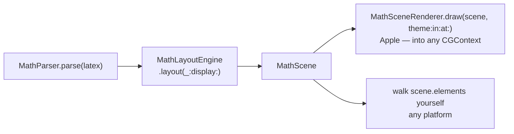

# Integrating Vinculum

A host-app guide: add the package, pick a theme, produce inline attachments,
and understand caching and threading. Vinculum was extracted from Quoin (a
native Markdown editor), so the integration story is "drop a math attachment
into a TextKit run" — but every stage is exposed if you want to drive the
pipeline yourself (images, PDF, SwiftUI `Canvas`, Linux).

---

## 1. Add the package

```swift
// Package.swift
dependencies: [
    .package(url: "https://github.com/clintecker/Vinculum.git", from: "1.0.0"),
],
targets: [
    .target(name: "MyApp", dependencies: [
        .product(name: "VinculumRender", package: "Vinculum"),
    ]),
]
```

Vinculum ships **two products**:

- **`VinculumRender`** (Apple-only: macOS 14 / iOS 17 / visionOS 1 / tvOS 17) —
  the CoreText measurer, the scene→CGContext renderer, the bundled font, the
  `MathTheme` seam, and the one-call `MathImageRenderer`. It re-exports the
  layout types you need (`MathParser`, `MathScene`, `MathLayoutEngine`,
  `MathMacros`, …), so a typical Apple app imports **only** `VinculumRender`.
- **`VinculumLayout`** (Foundation-only, **builds on Linux**) — the parser,
  the macro processor, the layout engine, and the device-independent
  `MathScene` IR. Depend on this alone if you want the platform-free layer
  without CoreText (see §7).

The bundled **Latin Modern Math** font ships as a package resource — no font
installation, no `Info.plist` entry, nothing for the host to register.

---

## 2. The one seam: `MathTheme`

`MathTheme` is the entire coupling between Vinculum and your design system.
Math is monochrome ink on a transparent attachment, so it needs just two
things:

```swift
public struct MathTheme: Sendable {
    public let ink: PlatformColor    // NSColor on macOS, UIColor on UIKit
    public let prefersDark: Bool
    public let fingerprint: String   // stable render-cache key component
    public init(ink: PlatformColor, prefersDark: Bool)

    public static let light = MathTheme(ink: .black, prefersDark: false)
    public static let dark  = MathTheme(ink: .white, prefersDark: true)
}
```

Use the presets, or build one from your palette:

```swift
let theme = MathTheme(ink: myDesignSystem.primaryTextColor,
                      prefersDark: traitCollection.userInterfaceStyle == .dark)
```

- `ink` colors every glyph and stroke (fraction rules, radicals, braces,
  arrows, text) — **unless** a `\color{…}{…}` or `\textcolor{…}{…}` subtree
  overrides it. That override is resolved during layout (as an sRGB
  `MathColor`), not here; `ink` is only the fallback for primitives that carry
  no explicit color.
- `prefersDark` pins the appearance (`.darkAqua` / `.aqua` on macOS, the
  `.dark` / `.light` trait on UIKit) while the image is rasterized, so a
  **dynamic/catalog color** ink resolves to the variant matching the canvas,
  not the ambient trait. It is folded into the `fingerprint`, so light and
  dark renders never collide in the cache.

**Light/dark:** build two themes (or rebuild on trait change) and re-request
the attachment; the cache keys on `theme.fingerprint`, so switching is a cache
hit after the first render of each appearance.

---

## 3. Produce an inline attachment (the one-call path)

The one-call path returns an `NSAttributedString` wrapping a baseline-aligned
`NSTextAttachment`:

```swift
import VinculumRender

func mathRun(_ latex: String, display: Bool) -> NSAttributedString? {
    MathImageRenderer.attachmentString(
        latex: latex,
        display: display,          // true = display style (stacked limits, larger parts)
        mathTheme: currentTheme,
        baseSize: bodyFont.pointSize)   // match the surrounding text
}
```

Splice it into your text storage:

```swift
if let run = mathRun(#"\int_0^1 x^2\,dx = \tfrac{1}{3}"#, display: false) {
    textView.textStorage?.replaceCharacters(in: selectedRange, with: run)
} else {
    // Unsupported: keep the literal source, or caption why (see §4).
    showSourceFallback(latex)
}
```

The attachment's `bounds` are offset by the scene descent, so it sits on the
text baseline and participates in line layout, selection, and line breaking
like any glyph. Works identically with `UITextView` on iOS/visionOS/tvOS — the
API returns `NSTextAttachment` on both.

**`display` vs. inline.** `display: true` uses display-style conventions
(limits stack over/under operators, fraction parts are larger) and internally
bumps the base size by 1.15×. Use it for standalone equation blocks; use
`display: false` for math inside a line of prose.

**Template images (automatic dark-mode + selection tinting).** When the scene
has **no explicit `\color`** anywhere (`scene.hasExplicitColor == false`), the
renderer emits a **tintable template image** (`NSImage.isTemplate = true` /
`UIImage.withRenderingMode(.alwaysTemplate)`). Such math inverts with the run
when selected and adapts to the appearance without a re-render — you get
correct selection and dark-mode behavior for free. As soon as any `\color`
appears in the equation, that subtree carries its own resolved color and the
image is no longer a template (so your explicit colors survive selection).

---

## 4. The `nil` contract — never a broken render

`attachmentString` returns `nil` **only** when the LaTeX contains an
unsupported command (it does not return `nil` for a mere typo — that renders as
whatever it parses to; nor for a degenerate zero-size scene). This is
deliberate: a document should degrade to a readable source fallback, never a
half-drawn equation. Always keep your own fallback path.

To explain the fallback (e.g. a caption or tooltip naming the culprit), use the
diagnostics on `MathParser`:

```swift
let node = MathParser.parse(latex)
if !MathParser.isFullySupported(node) {
    let names = MathParser.unsupportedCommands(in: node, limit: 4)  // first-seen, deduped, capped
    // e.g. names == ["\\sideset"]  →  "Contains \\sideset"
}
```

`isFullySupported(_:) -> Bool` is the exact gate `attachmentString` uses
internally; `unsupportedCommands(in:limit:) -> [String]` returns the offending
command names in first-seen order (deduplicated, capped at `limit`) so you can
build a precise fallback caption.

---

## 5. Caching behavior

- `MathImageRenderer` caches rendered images in an `NSCache`, keyed by
  `display | theme.fingerprint | baseSize | latex`. The key is fully determined
  by the arguments, so the cache is consulted **before** parsing — a hit costs
  no parse/layout/raster. Re-requesting the same equation at the same size and
  theme is a dictionary hit, cheap to call in a `layoutManager` / cell-reuse
  loop or on every keystroke in a live editor.
- **Negative caching:** unsupported/degenerate LaTeX is remembered as a
  `nil`-image entry, so re-projecting known-bad source never re-parses.
- The cache is **bounded** (`countLimit = 512`, `totalCostLimit = 32 MB` of
  bitmap bytes) and memory-pressure aware — `NSCache` self-trims; you don't
  manage eviction. There is no manual "clear cache" API; it is process-lifetime.
- Changing `baseSize` or theme produces a distinct entry — expected, since the
  raster differs. If you support Dynamic Type or theme switching, the first
  render at each configuration pays layout cost; subsequent ones are hits.

---

## 6. Thread-safety

- **Layout is `Sendable` and main-thread-independent.** `MathParser`,
  `MathNode`, `MathScene`, `MathElement`, `MathColor`, `MathTheme`,
  `GlyphMetrics`, and `MathLayoutEngine` are all `Sendable`; the measurer
  typealias `MathTextMeasurer` is `@Sendable`. Parsing and `engine.layout(...)`
  can run on any queue — precompute scenes off the main thread if you like. The
  whole layout stage is platform-free (usable on Linux / in SwiftUI with your
  own measurer + renderer).
- **`CoreTextMeasurer.make()`** returns a `@Sendable` closure; its glyph-metric
  cache and the shared `CTFont` are lock-guarded (`NSLock`), so it's safe to
  share across threads — a duplicate concurrent miss just recomputes the same
  value.
- **`MathImageRenderer`'s cache** is an `NSCache` (documented thread-safe).
- **Rasterization** uses platform image APIs (`NSImage(size:flipped:)` /
  `UIGraphicsImageRenderer`). These follow your platform's norms for image
  creation; the safest pattern is to request attachments from the main actor if
  you're driving a text view there, and precompute *scenes* (pure geometry)
  off-main when you want to parallelize.

A common pattern: parse + lay out many equations concurrently into `MathScene`
values (pure `Sendable` geometry), then hop to the main actor to draw or build
attachments.

---

## 7. Driving the pipeline yourself

Want to render math on Linux, in a SwiftUI `Canvas`, in a Metal pipeline, to
PDF, or into a custom view — anywhere that isn't an `NSTextAttachment`? Drive
the three stages directly:



### On Apple platforms — lay out, then draw into any `CGContext`

Reuse the shipped CoreText pieces and the scene renderer; this is exactly what
`MathImageRenderer` does internally, so you can retarget it at a PDF context, a
`CALayer`, or a `drawRect:`:

```swift
import VinculumRender

let measure  = CoreTextMeasurer.make()                 // @Sendable measurer
let delims   = CoreTextDelimiterProvider.make()         // MATH-table variant provider (optional)

let node  = MathParser.parse(#"\left( \sum_{i=1}^n x_i \right)"#)
guard MathParser.isFullySupported(node) else { /* fallback */ return }

let engine = MathLayoutEngine(measure: measure, baseSize: 17, delimiters: delims)
let scene  = engine.layout(node, display: true)         // -> MathScene (device-independent)

// Draw into a y-up CGContext with the baseline origin at `at:`.
MathSceneRenderer.draw(scene, theme: .light, in: cgContext, at: CGPoint(x: 4, y: scene.descent + 4))
```

`scene.width`, `scene.ascent`, `scene.descent` (and `scene.height`) give the
bounding box; the scene is **y-up with the origin on the baseline**.
`MathSceneRenderer.draw` expects a y-up context (flip a UIKit/PDF context as
`MathImageRenderer` does for UIKit).

The **`delimiters:` provider is optional.** `CoreTextDelimiterProvider.make()`
supplies the font's MATH-table size variants so tall `( ) [ ] { }` fences use
purpose-drawn taller glyphs at constant stroke weight; pass `nil` (the default)
and delimiters fall back to continuous glyph scaling — which is also the
headless/Linux default.

### On any platform (incl. Linux / SwiftUI) — walk the scene

`MathScene` is Foundation-only geometry. Supply your own measurer and iterate
the positioned primitives:

```swift
import VinculumLayout   // Foundation only; builds on Linux

// 1. Supply a measurer (on Apple platforms, CoreTextMeasurer.make() exists in
//    VinculumRender; on Linux, implement the closure with your font system).
let measure: MathTextMeasurer = { text, size, mono in
    // return GlyphMetrics(width:ascent:descent:inkAscent:inkDescent:)
    myFontEngine.metrics(of: text, size: size, mono: mono)
}

let node  = MathParser.parse(#"\sqrt{a^2 + b^2}"#)
let scene = MathLayoutEngine(measure: measure, baseSize: 17).layout(node, display: true)

// 2. Walk scene.elements yourself — four primitives:
for element in scene.elements {
    switch element {
    case let .glyphs(text, size, mono, origin, color):  // draw a glyph run at origin
    case let .rule(rect, color):                        // fill a rectangle (bars, boxes)
    case let .stroke(path, width, cap, join, color):    // stroke a PathOp path (radicals, braces, arrows)
    case let .glyph(id, size, origin, color):           // draw one glyph by ID (MATH-table delimiter variant)
    }
}
```

A `nil` element `color` means "use your ink"; a non-nil `MathColor` is a
resolved `\color` you should honor. The `.glyph(id:…)` case only appears when
you passed a `MathDelimiterProvider` that returned a variant — without one you
will only see the other three cases.

**SwiftUI:** lay out a `MathScene` off-main, then translate `scene.elements`
into `Path`/`Text` inside a `Canvas` — the same primitives.

---

## 8. Macros across a document

If your host has multiple math blocks that share `\newcommand` / `\def`
definitions, collect them once and expand each block:

```swift
import VinculumLayout   // (re-exported by VinculumRender)

let table    = MathMacros.collectDefinitions(from: entireDocumentText)  // scans all math segments
let expanded = MathMacros.expand(oneBlockLatex, with: table)            // strips defs, substitutes uses
let node     = MathParser.parse(expanded)
```

`collectDefinitions` uses `MathScanner` to find `$…$` / `$$…$$` segments, so a
`\newcommand` written in prose or a code fence is ignored. Definitions are
**document-scoped and order-independent**; a later `\renewcommand` (or `\def`)
of the same name wins. `expand(_:with:limit:)` strips the definition commands
(they produce no output) and substitutes `#1`…`#9` parameters, bounded by
`limit` (default 2000) total expansions with a hard recursion cap so a
self-referential macro degrades instead of hanging. `MathMacros.isDefinitionOnly`
lets a definitions-only block render a chip instead of an empty box.

---

## 9. A note on `\tag`

`\tag{n}` / `\tag*{n}` (and `\notag`) parse, but Vinculum appends the tag
**inline** at the end of the equation as `body \qquad (n)` (no parens for the
starred `\tag*`). True **flush-right placement and automatic equation
numbering are a host concern** — they need the column/line width, which layout
(a device-independent stage) doesn't have. If you want AMS-style right-aligned
tags, measure the scene, position it yourself in your line box, and lay the tag
out as a separate run at the right margin.
